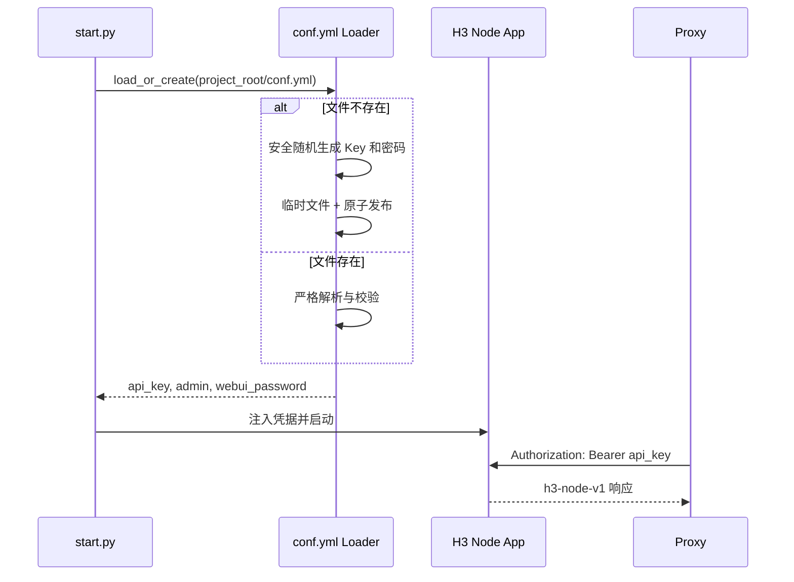

# MiniMax-H3 Node 单 Key 与 conf.yml 配置设计

## 背景与目标

MiniMax-H3 Node 当前从 `.env` 读取多个带 Key ID、摘要和 scope 的 API Key，并单独读取 WebUI 用户名和密码摘要。Proxy 管理页面因此要求填写 Key ID 与 Secret 两个字段，配置和认证链路过于复杂，并且已经出现两端 Token 拼装规则不一致的问题。

本次改为端到端单 Key：Proxy 前端只填写一个 API Key，Node 使用同一个 Key 鉴权全部内部 API。Node 根目录的 `conf.yml` 是 API Key 和 WebUI 凭据的唯一来源；不存在时自动生成一次，存在时只读取，绝不覆盖。

本设计是 Node 凭据规则的最新权威来源，覆盖 `specs/developing/version_0.0.1/changes/004-manager-node-configuration/` 中所有 Key ID、scope、`key_id.secret` 和多 Key 相关条款。实施时必须同步修订该变更包的 PRD、技术方案、API、数据库、原型、任务与验收文档。

## 已确认决策

- API Key 固定为 32 位 ASCII 字母和数字，使用操作系统密码学安全随机源生成。
- WebUI 用户名固定为 `admin`。
- WebUI 密码固定为 8 位 ASCII 字母和数字，使用安全随机源生成，并保证至少包含一个字母和一个数字。
- `conf.yml` 存在时完全忽略 `.env` 中的 `H3_API_KEYS`、`H3_UI_USERNAME` 和 `H3_UI_PASSWORD_HASH`。
- Node API 只接受 `Authorization: Bearer <key>`，不再接受 `key_id.secret`。
- 一个 Key 对全部 `/internal/v1` 路由有效，不再配置 Key ID 或 scope。
- Proxy 数据库暂时保留旧 `api_key_id` 列以降低升级风险，但应用层不再读取、写入或返回该字段。

## 配置文件

### 路径与结构

配置文件固定为 MiniMax-H3 项目根目录下的 `conf.yml`。路径以 `start.py` 文件所在目录为基准解析，不使用进程当前工作目录。

```yaml
api:
  key: "Ab3...共32位字母数字"
webui:
  username: "admin"
  password: "A1b2C3d4"
```

`conf.yml` 只负责 Node API 和 WebUI 凭据。监听地址、端口、TLS、数据库路径、日志等非凭据运行参数继续沿用现有命令行和环境配置，避免把本次改动扩大为通用配置迁移。

### 首次生成

启动入口在构造 `ServiceSettings` 前调用独立的凭据配置加载器：

1. 以项目根目录解析 `conf.yml`。
2. 文件存在则进入严格读取流程。
3. 文件不存在则生成 32 位 API Key、固定用户名 `admin` 和合规的 8 位密码。
4. 在同目录创建临时文件，完整写入 UTF-8 无 BOM YAML，刷新并关闭后原子重命名为 `conf.yml`。
5. 创建时使用“目标必须不存在”的语义处理并发启动；若另一进程先创建成功，放弃临时值并重新读取正式文件。
6. 尽力限制为仅当前用户可读写。POSIX 使用 `0600`；Windows 不依赖 POSIX mode 作为唯一安全保证，并在无法收紧权限时输出不含凭据的警告。

生成成功后，启动日志只说明文件路径和“凭据已生成”，不得打印 Key 或密码。部署人员直接查看本机 `conf.yml` 获取首次凭据。

### 已有文件读取

已有文件只读取，不补字段、不旋转、不格式化回写。加载器使用安全 YAML 解析，拒绝：

- YAML 语法错误、重复键、未知顶层或子字段；
- 缺少 `api.key`、`webui.username` 或 `webui.password`；
- API Key 不是严格 32 位字母数字；
- 用户名不是 `admin`；
- 密码不是严格 8 位字母数字，或没有同时包含字母和数字；
- 标量不是字符串，包括 YAML 自动解析的数字、布尔值和空值。

任一错误都在 HTTP/Gradio/ComfyUI 监听前终止启动。错误只包含配置路径和字段名，不回显非法值。加载器不会退回 `.env`，也不会用随机值替代损坏字段。

## Node 认证与 WebUI

凭据不进入 `ServiceSettings`，避免 Pydantic Settings 自动把 `H3_API_KEY` 或类似环境变量重新变成隐式配置源。加载器返回独立的 `CredentialConfig`，`start.py` 将它显式传给 `create_app` 和 WebUI 认证构造器；`ServiceSettings` 只保留非凭据运行参数。现有 `APIKeyConfig` 多 Key 模型和凭据环境字段删除。

Node 的 `Authenticator` 从 `CredentialConfig` 取得唯一 Key，只解析标准 Bearer 头，并使用恒定时间比较请求 Key 和配置 Key。以下请求都返回统一 401：缺少 Bearer、空 Key、错误 Key、旧 `key_id.secret` Token。认证成功后不再构造 Key ID 或 scope Principal；路由仍保留认证依赖，但不做 scope 分支。

WebUI 启动时把 `conf.yml` 中的明文密码转换为内存中的认证校验器。密码不写入其他文件、不生成额外摘要配置、不进入日志。Gradio 登录用户名固定使用 `admin`。

## Proxy 接口与持久化

### Manager 表单和 API

节点表单删除 Key ID，只保留“API Key”密码输入框。新建 H3 节点或把 Legacy 节点升级为 H3 时 API Key 必填；编辑已有 H3 节点时留空表示复用已加密保存的 Key。

Manager 请求对象删除 `api_key_id`：

```json
{
  "id": "minimax-private-1",
  "service_url": "http://127.0.0.1:7860",
  "protocol_version": "h3-node-v1",
  "api_key": "32位字母数字Key",
  "poll_interval": "3s",
  "request_timeout": "30s",
  "enabled": true
}
```

API Key 校验与 Node 完全一致：严格 32 位字母数字。响应继续只返回 `api_key_configured` 和指纹，不返回 Key。请求出现废弃字段 `api_key_id` 时由严格 JSON 解析返回 400，避免调用方误以为该字段仍生效。

连接测试、Registry、Orchestrator、Profile Test、Artifact 和 Cleanup 的 Node 客户端全部直接发送 `Bearer <key>`，不再拼接或传递 Key ID。

### 数据库兼容

本次不为删除 `api_key_id` 重建 `model_service_nodes`。现有列保留为兼容列：

- 新建或更新 H3 节点写入固定空字符串作为兼容占位，实际认证只读取加密 Key；
- 已有 H3 记录继续使用原加密 Secret，忽略旧 Key ID；若历史 Secret 本身是单独的 Secret 而非完整 Token，管理员必须将其更新为 Node `conf.yml` 中的新单 Key；
- Legacy 节点仍无 Key，升级时只要求一个新 Key；
- DTO、领域模型、运行时工厂和日志删除 Key ID 语义。

由于 v7 数据库 CHECK 当前要求 H3 节点 `api_key_id IS NOT NULL`，兼容占位使用非 NULL 空字符串，不能写 NULL。未来数据库整理可以单独重建表并物理删除该列，不纳入本次范围。

## 启动与数据流



## 安全约束

- 随机值使用 Python `secrets`，不得使用 `random`、时间戳、UUID 截断或可预测种子。
- API Key 和密码字符集固定为 `A-Z a-z 0-9`，避免 YAML、HTTP Header、命令行和复制时转义问题。
- 密码生成后若不同时含字母和数字则重新生成，不通过固定位置强塞字符造成分布偏差。
- `conf.yml` 加入 `.gitignore`，示例使用 `conf.example.yml` 且不得含真实凭据。
- API Key、WebUI 密码、Authorization 头和完整配置内容不得进入日志、异常、Manager 响应或测试快照。
- 配置文件是明文凭据真相源，部署备份、主机权限和文件传输都必须按敏感文件处理。

## 错误处理

| 场景 | 行为 |
| --- | --- |
| 首次生成临时文件失败 | 启动失败，删除本进程临时文件，不创建半成品 |
| 原子发布时目标已存在 | 读取获胜进程生成的正式文件 |
| `conf.yml` 无法读取 | 启动失败，不回退 `.env` |
| YAML 或字段非法 | 启动失败，只报告路径和字段 |
| API 请求 Key 错误 | 401 统一错误包，不说明正确 Key 是否存在 |
| Proxy 保存的 Key 不匹配 | 连接测试返回稳定认证失败；管理员更新为 `conf.yml` 中的 Key |

## 测试策略

### MiniMax-H3

- 临时项目目录首次启动生成 `conf.yml`，Key 为严格 32 位字母数字，用户名为 admin，密码为严格 8 位且包含字母和数字。
- 连续两次加载得到完全相同的文件字节和凭据，第二次不修改 mtime。
- 并发首次加载最终只有一个有效正式文件，所有加载者读取相同凭据。
- YAML 损坏、重复/未知字段、缺字段和每个格式边界均拒绝启动，文件内容不变。
- 即使环境中设置旧凭据变量，应用仍只接受 `conf.yml` 的单 Key。
- 单 Key 可访问全部 12 条内部路由；旧 `key_id.secret`、错误和缺失 Token 返回 401。
- WebUI 只接受 `admin` 和配置密码；密码不出现在日志。

### MiniMax-H3-Proxy

- Manager HTML/JS 和请求 DTO 不再包含 `api_key_id`。
- 新建/升级要求严格 32 位字母数字；编辑留空复用密钥，错误长度和非字母数字拒绝。
- Node 客户端所有消费路由发送精确的 `Bearer <key>`。
- 现有带 Key ID 的数据库可直接打开，旧加密 Key 可读取，更新后兼容列保持非 NULL。
- 捕获日志和 HTTP 响应，确认没有 Key、密文、Nonce 或 Authorization 头。
- 使用本地 Node 进程完成 health、capabilities、execution、cancel 和 artifact 端到端联调。

## 发布与兼容

这是内部 Node API 的有意破坏性认证变更，Node 与 Proxy 必须配套发布：

1. 停止 Proxy 对目标 Node 的调度。
2. 发布 Node；首次启动生成 `conf.yml`，运维读取生成的 Key 和 WebUI 密码。
3. 发布 Proxy，在 Manager 中把该节点 API Key 更新为 `conf.yml` 中的 Key并执行连接测试。
4. 连接测试通过后重新启用节点。

旧 `.env` 凭据、旧 Key ID、scope 和 `key_id.secret` Token 不提供兼容窗口。回滚前必须保留原 `.env` 和新 `conf.yml` 的安全备份；回滚旧 Node 时旧 Proxy 配置需要人工恢复。

## 不在范围

- 在线查看、复制、轮换或重置 Node Key 和 WebUI 密码。
- 多 Key、Key ID、scope、过期时间或审计页面。
- 把端口、TLS、数据库、日志等所有 Node 设置迁入 `conf.yml`。
- 自动把旧 `.env` 凭据迁移到 `conf.yml`。
- 本次物理删除 Proxy 数据库的 `api_key_id` 兼容列。
