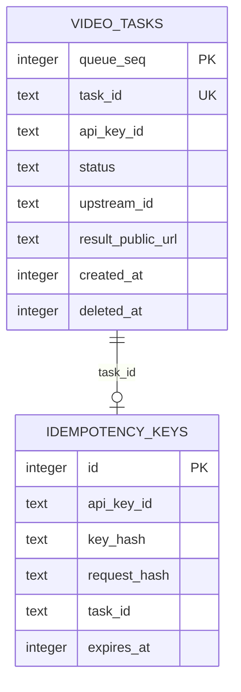
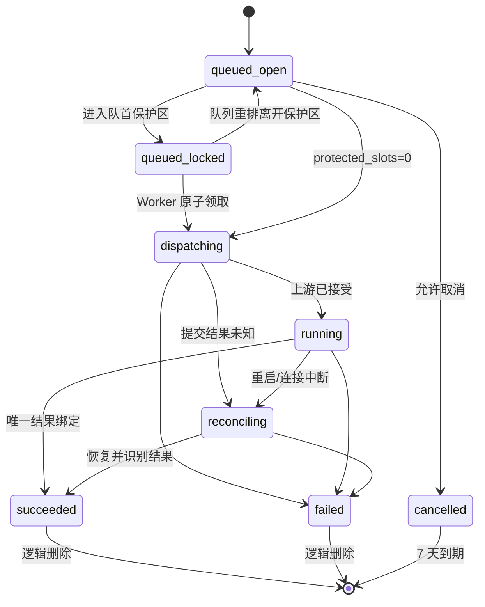

# `v0.0.1` SQLite 数据库设计

## 1. 概述

- 数据库：SQLite 单文件，UTF-8，时间统一存 Unix 秒。
- 业务对象：视频任务、幂等键。
- API Key 和上游定义来自配置，不建立数据库主表。
- SQLite 是任务队列和状态的唯一真相源；不使用内存队列持久化状态。
- 任务保留窗口为创建时间起 7 天，使用逻辑删除。

启动 PRAGMA：

```sql
PRAGMA journal_mode = WAL;
PRAGMA foreign_keys = ON;
PRAGMA busy_timeout = 5000;
PRAGMA synchronous = NORMAL;
```

## 2. ER 图



## 3. `video_tasks`

表说明：保存 V2 任务、FIFO 顺序、上游归属、恢复上下文和结果。`queue_seq` 同时作为稳定队列顺序。

| 字段 | SQLite 类型 | 必填 | 默认值 | 索引 | 说明 |
| --- | --- | --- | --- | --- | --- |
| `queue_seq` | INTEGER | 是 | 自增 | PK | 内部顺序，不对外返回 |
| `task_id` | TEXT | 是 | - | UNIQUE | 外部任务 ID |
| `api_key_id` | TEXT | 是 | - | INDEX | 配置中的稳定 Key ID |
| `model` | TEXT | 是 | `MiniMax-H3` | - | V2 模型 |
| `task_type` | TEXT | 是 | `generation` | INDEX | 首版固定 generation |
| `modality` | TEXT | 是 | `video` | - | 首版固定 video |
| `scenario` | TEXT | 是 | - | - | `t2va/i2va/r2va` |
| `request_json` | TEXT | 是 | - | - | 规范化 V2 请求 JSON |
| `request_hash` | TEXT | 是 | - | - | SHA-256，用于幂等冲突判断 |
| `status` | TEXT | 是 | `queued_open` | INDEX | 内部状态 |
| `cancel_locked` | INTEGER | 是 | 0 | - | 0/1，便于检查与审计 |
| `upstream_id` | TEXT | 否 | NULL | PARTIAL UNIQUE | 已领取实例 ID |
| `gradio_event_id` | TEXT | 否 | NULL | - | Gradio 传输标识 |
| `gallery_before_json` | TEXT | 否 | NULL | - | 归一化基线 JSON |
| `result_internal_url` | TEXT | 否 | NULL | - | 上游原始结果，响应禁止返回 |
| `result_public_url` | TEXT | 否 | NULL | - | V2 `task.content.url` |
| `resolution` | TEXT | 是 | - | - | `480P/768P/2K` |
| `duration` | INTEGER | 是 | - | - | 4-15 秒 |
| `ratio_requested` | TEXT | 是 | `adaptive` | - | 原请求比例 |
| `ratio_actual` | TEXT | 否 | NULL | - | 可确认时记录，否则返回请求值 |
| `usage_total_seconds` | INTEGER | 是 | 0 | - | 输出 + 可识别输入秒数 |
| `usage_input_seconds` | INTEGER | 是 | 0 | - | 无法探测时为 0 |
| `usage_output_seconds` | INTEGER | 是 | 0 | - | 成功时等于 duration |
| `usage_input_image_count` | INTEGER | 是 | 0 | - | 首尾帧与参考图数量 |
| `error_code` | TEXT | 否 | NULL | - | 对外稳定错误码 |
| `error_message` | TEXT | 否 | NULL | - | 脱敏失败原因 |
| `created_at` | INTEGER | 是 | - | INDEX | Unix 秒 |
| `updated_at` | INTEGER | 是 | - | - | Unix 秒 |
| `started_at` | INTEGER | 否 | NULL | - | 首次进入 dispatching |
| `finished_at` | INTEGER | 否 | NULL | - | 终态时间 |
| `expires_at` | INTEGER | 是 | - | INDEX | created_at + retention |
| `deleted_at` | INTEGER | 否 | NULL | PARTIAL INDEX | 逻辑删除时间 |
| `version` | INTEGER | 是 | 0 | - | 乐观检查与诊断 |

约束：

```sql
CHECK (status IN ('queued_open','queued_locked','dispatching','running','reconciling','succeeded','failed','cancelled'))
CHECK (scenario IN ('t2va','i2va','r2va'))
CHECK (resolution IN ('480P','768P','2K'))
CHECK (duration BETWEEN 4 AND 15)
CHECK (cancel_locked IN (0,1))
```

核心索引：

| 索引 | 字段/条件 | 类型 | 目的 |
| --- | --- | --- | --- |
| `uq_video_tasks_task_id` | `task_id` | 唯一 | 外部 ID |
| `idx_video_tasks_owner_time` | `api_key_id, created_at DESC` WHERE `deleted_at IS NULL` | 普通 | 单 Key 列表 |
| `idx_video_tasks_owner_status` | `api_key_id, status, created_at DESC` WHERE `deleted_at IS NULL` | 普通 | 限额与筛选 |
| `idx_video_tasks_queue` | `queue_seq` WHERE status IN queued | 普通 | FIFO 与保护位 |
| `idx_video_tasks_expiry` | `expires_at` WHERE `deleted_at IS NULL` | 普通 | 7 天清理 |
| `uq_video_tasks_active_upstream` | `upstream_id` WHERE status IN (`dispatching`,`running`,`reconciling`) | 唯一部分索引 | 每实例单任务硬约束 |

`request_json` 包含媒体 URL，属于敏感业务数据：日志不得输出；数据库 Volume 权限必须限制为服务用户；首版不额外加密，部署文档必须说明磁盘加密责任。

## 4. `idempotency_keys`

表说明：保存可选 `Idempotency-Key` 的摘要与任务映射，不保存原始幂等键。

| 字段 | SQLite 类型 | 必填 | 默认值 | 索引 | 说明 |
| --- | --- | --- | --- | --- | --- |
| `id` | INTEGER | 是 | 自增 | PK | 内部主键 |
| `api_key_id` | TEXT | 是 | - | UNIQUE 组合 | Key 所有者 |
| `key_hash` | TEXT | 是 | - | UNIQUE 组合 | SHA-256 摘要 |
| `request_hash` | TEXT | 是 | - | - | 规范化请求摘要 |
| `task_id` | TEXT | 是 | - | INDEX | 逻辑关联任务 |
| `created_at` | INTEGER | 是 | - | - | 创建时间 |
| `expires_at` | INTEGER | 是 | - | INDEX | 默认 24 小时 |

约束与索引：

- 唯一约束：`(api_key_id, key_hash)`。
- `task_id` 逻辑关联 `video_tasks.task_id`；不使用级联物理删除，因为任务采用逻辑删除。
- 到期记录由 Cleaner 物理删除；创建请求先清理/忽略过期记录再判断。

## 5. 状态迁移



禁止迁移：任何状态回到 `queued_*`，除非错误被明确分类为提交前连接失败；该重排必须在事务中清除 `upstream_id/gradio_event_id/gallery_before_json` 并重算保护位。

## 6. 事务设计

| 操作 | 事务 | 隔离方式 | 变更 |
| --- | --- | --- | --- |
| 创建任务 | 是 | `BEGIN IMMEDIATE` | 幂等判断、额度计数、insert、保护位重算 |
| 领取任务 | 是 | `BEGIN IMMEDIATE` | 检查实例、条件领取、保护位重算 |
| 取消任务 | 是 | `BEGIN IMMEDIATE` | 所有权/状态检查、cancel、保护位重算 |
| 删除终态 | 是 | `BEGIN IMMEDIATE` | 设置 deleted_at、失效幂等关系 |
| 保存基线/event | 是，短事务 | 条件 UPDATE + version | 保存恢复上下文 |
| 完成/失败 | 是，短事务 | 状态条件 UPDATE | 写终态、结果或错误 |
| 列表/单查 | 否，单 SQL | 读事务由驱动管理 | 所有权 + 7 天窗口 + 未删除 |
| 定时清理 | 是，分批 | 每批 `BEGIN IMMEDIATE` | 逻辑删除任务、删除过期幂等 |

网络调用不得在事务内。所有状态 UPDATE 必须包含预期旧状态，受影响行数不是 1 时重新读取并按最新状态处理。

保护位重算伪 SQL：

```sql
WITH ranked AS (
  SELECT queue_seq,
         ROW_NUMBER() OVER (ORDER BY queue_seq) AS rn
  FROM video_tasks
  WHERE deleted_at IS NULL
    AND status IN ('queued_open', 'queued_locked')
)
UPDATE video_tasks
SET status = CASE
      WHEN queue_seq IN (SELECT queue_seq FROM ranked WHERE rn <= :protected_slots)
        THEN 'queued_locked'
      ELSE 'queued_open'
    END,
    cancel_locked = CASE
      WHEN queue_seq IN (SELECT queue_seq FROM ranked WHERE rn <= :protected_slots)
        THEN 1 ELSE 0 END,
    updated_at = :now,
    version = version + 1
WHERE queue_seq IN (SELECT queue_seq FROM ranked);
```

## 7. 接口读写映射

| 接口/流程 | 读取 | 写入 | 事务 |
| --- | --- | --- | --- |
| `POST /v2/video_generation` | tasks、idempotency | 两表 | 是 |
| 单任务查询 | tasks | 无 | 否 |
| 任务列表 | tasks | 无 | 否 |
| `DELETE` | tasks、idempotency | tasks，必要时 idempotency | 是 |
| Worker 领取 | tasks | tasks | 是 |
| Gallery 基线/完成 | tasks | tasks | 是，短事务 |
| Cleaner | tasks、idempotency | 两表 | 是，分批 |

## 8. 初始化与迁移

- `migrations/*.sql` 使用 `//go:embed` 打包到二进制。
- 启动时获取进程内迁移锁，按版本在事务内执行；失败则拒绝启动。
- 版本 1 创建 `schema_migrations`、`video_tasks`、`idempotency_keys` 与索引。
- 版本 2 扩展分辨率约束，并将升级前实际属于 480 档的历史 `768P` 字段及 `request_json.resolution` 修正为 `480P`。
- 回滚采用部署前备份 SQLite 文件并回退二进制；不提供自动 down migration，避免破坏数据。
- Docker 启动前/升级前的备份流程需在部署文档中说明并人工执行。

## 9. 查询与性能

- 列表使用 `api_key_id + created_at`，`page_num/page_size` 与官方一致；首版允许 offset 分页，因为最多保留 7 天且全局未结束上限 100。
- `filter.task_ids` 先限制数量，防止超长 IN；具体上限在 API 文档定义为 100。
- SQLite 连接池最大打开连接建议 1，所有事务保持短小；后续压测证明读并发不足时再调整。
- 每次清理最多处理配置批量，避免长写锁。

## 10. 待人工确认

| 问题 | 影响 | 确认方式 |
| --- | --- | --- |
| WAL 在目标 Volume/文件系统上的可靠性 | 数据安全 | 目标 Docker 环境重启与断电演练 |
| Gallery JSON 样本 | `gallery_before_json` 规范 | 真实实例采样并固化 fixture |
| 运行中任务的上游状态文本 | 恢复与失败判定 | 三类生成联调 |
| 7 天窗口边界时区 | 查询一致性 | 按 UTC Unix 秒验收 |
