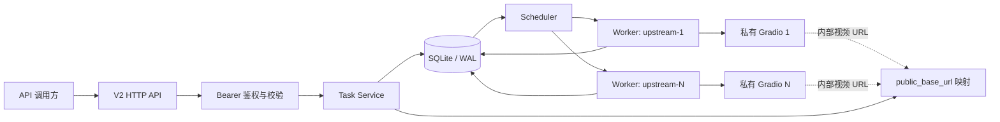
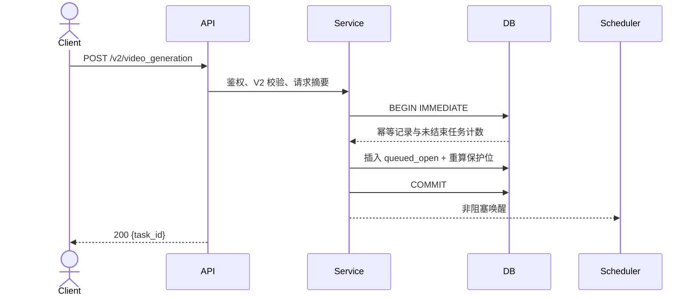
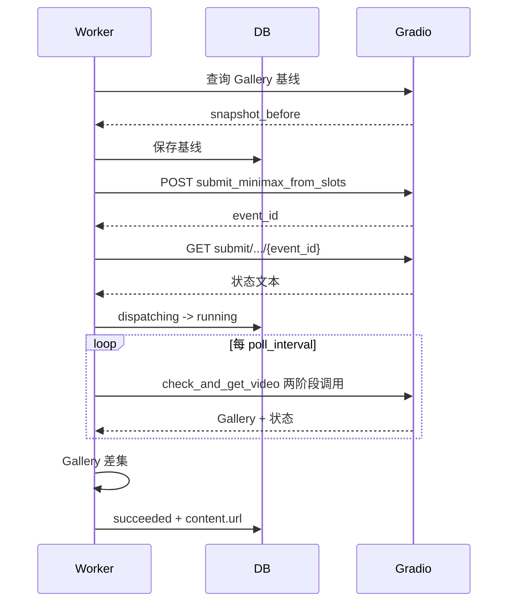

# MiniMax H3 V2 中转服务技术实现方案

| 项目 | 内容 |
| --- | --- |
| 项目名称 | `minimax-h3-tc` |
| 版本 | `v0.0.1` |
| 设计范围 | Go 服务、V2 API、SQLite、多上游调度、Gradio 适配、Docker |
| 状态 | 已实现并通过本地自动化验证，待真实私有服务人工联调 |

## 1. 背景与目标

私有 MiniMax-H3 服务通过 Gradio 暴露固定 32 位参数、全局队列与 Gallery，没有可供多调用方使用的业务任务 ID。中转服务需要在不改造模型服务的前提下，对外实现 MiniMax H3 V2 的视频生成、查询、列表和取消/删除接口。

本方案目标：

- 采用 Go 单进程和 SQLite 单文件部署，不引入 Redis、MQ 或外部数据库。
- 使用官方 `/v2` 路径、`content + role` 请求、任务对象和 OpenAI 风格错误响应。
- 支持文生 `t2va`、图生 `i2va`、多模态参考 `r2va`。
- 调度多个私有实例并行，每个实例严格单任务。
- 原子执行队首保护、任务领取和取消，阻止临近执行时取消。
- 通过持久化 Gallery 基线与差集，将全局结果绑定到本地任务。

不实现 H3-Context-IR、视频再生成、回调、输出视频代理、对象存储和上游物理文件删除。

## 2. 技术栈与工程结构

| 领域 | 选择 | 原因 |
| --- | --- | --- |
| 语言 | Go，版本由 `go.mod` 固定 | 单二进制、并发与流式 HTTP 成本低 |
| HTTP | 标准库 `net/http` | 接口数量少，减少框架依赖 |
| 配置 | `gopkg.in/yaml.v3` + 环境变量展开 | YAML 可读，私有地址可只放环境变量 |
| 数据库 | SQLite + `modernc.org/sqlite` | 纯 Go，无 CGO，单文件部署 |
| 日志 | `log/slog` JSON Handler | 标准库结构化日志 |
| 测试 | `testing`、`httptest`、临时 SQLite | 无额外测试运行时 |

建议源码结构：

```text
cmd/server/main.go
cmd/healthcheck/main.go
internal/config/
internal/domain/
internal/httpapi/
internal/store/sqlite/
internal/task/
internal/scheduler/
internal/upstream/gradio/
internal/worker/
migrations/001_init.sql
config.example.yaml
Dockerfile
```

各目录只暴露最小接口；HTTP DTO、数据库记录和领域对象不得复用同一结构体。

## 3. 核心概念

| 名词 | 代码名 | 说明 |
| --- | --- | --- |
| 外部任务 | `Task` | 中转层生成、按 API Key 隔离的 V2 任务 |
| 内部状态 | `InternalStatus` | 含可取消排队、锁定排队、提交中、恢复中等细状态 |
| 外部状态 | `V2Status` | `queued/running/succeeded/failed/cancelled` |
| 保护位 | `ProtectedSlots` | 全局队首不可取消的等待任务数，默认 3 |
| 上游实例 | `Upstream` | 一个独占的私有 MiniMax-H3 Gradio 服务 |
| Gallery 基线 | `GallerySnapshot` | 提交前该实例已存在视频的归一化指纹集合 |
| 结果差集 | `GalleryDelta` | 完成后 Gallery 相对基线唯一新增的视频 |

内部状态映射：

| 内部状态 | V2 状态 | 可取消 | 说明 |
| --- | --- | --- | --- |
| `queued_open` | `queued` | 是 | 位于保护区之外 |
| `queued_locked` | `queued` | 否 | 位于队首保护区 |
| `dispatching` | `running` | 否 | 已领取，正在获取基线或提交 |
| `running` | `running` | 否 | 上游生成中 |
| `reconciling` | `running` | 否 | 重启后恢复结果识别 |
| `succeeded` | `succeeded` | 否 | 已绑定唯一结果 URL |
| `failed` | `failed` | 否 | 上游失败或结果无法唯一归属 |
| `cancelled` | `cancelled` | 否 | 在普通排队区取消 |

逻辑删除通过 `deleted_at` 表达，不增加 V2 状态。

## 4. 模块设计

| 模块 | 职责 | 依赖 |
| --- | --- | --- |
| `config` | YAML、`${ENV}` 展开、启动校验和默认值 | 文件、环境变量 |
| `httpapi` | 路由、Bearer 鉴权、请求 ID、V2 DTO、错误映射 | `task` 服务 |
| `task` | 创建、幂等、查询、列表、取消/删除、状态映射 | Store |
| `scheduler` | 队列保护重算、空闲实例领取、唤醒 | Store、Registry |
| `worker` | 基线、提交、轮询、结果绑定、失败分类 | Gradio Client、Store |
| `upstream/gradio` | 两阶段 Gradio 调用、SSE 解析、32 参数映射、Gallery 解析 | HTTP Client |
| `store/sqlite` | 迁移、事务、任务与幂等仓储 | SQLite |
| `cleaner` | 7 天逻辑删除、幂等过期清理 | Store |

## 5. 总体架构



- SQLite 是任务、队列顺序和状态的唯一真相源，内存只保存配置、健康状态和唤醒信号。
- 每个配置上游启动一个串行 Worker；数据库部分唯一索引再次保证单实例单活任务。
- 所有网络调用均在事务外执行，避免长事务阻塞 API。

## 6. 配置设计

```yaml
server:
  address: ":8080"
  read_timeout: 15s
  write_timeout: 15s

database:
  path: /data/minimax.db

queue:
  protected_slots: 3
  per_key_unfinished_limit: 10
  global_unfinished_limit: 100

task:
  retention: 168h
  idempotency_ttl: 24h

api_keys:
  - id: customer-a
    key: ${MINIMAX_API_KEY_CUSTOMER_A}
    enabled: true

upstreams:
  - id: gpu-1
    base_url: ${MINIMAX_UPSTREAM_GPU_1_URL}
    public_base_url: https://video-1.example.com
    health_path: /
    poll_interval: 3s
    request_timeout: 30s

generation_profiles:
  480P:
    model_mode: high_quality
    steps: 20
    dimensions:
      "16:9": {width: 832, height: 480}
  768P:
    model_mode: high_quality
    steps: 20
    dimensions:
      "16:9": {width: 1344, height: 768}
  2K:
    model_mode: custom
    steps: 20
    dimensions: {}
```

示例中的生成规格仅展示结构，不是验收后的生产参数。实现必须要求部署方为允许的 `resolution + ratio` 配置完整映射；缺失组合在启动校验或请求校验时失败，不猜测尺寸。`adaptive` 使用对应分辨率的专用配置项。

配置优先级为环境变量展开后的 YAML值，再使用程序默认值。私有 `base_url` 不允许明文固定在示例文件；Key 可使用明文或 `${ENV}`，推荐环境变量。启动校验必须覆盖重复 ID、空 Key、非法 URL、非 HTTPS 公网地址、重复 Key、缺失规格映射和不可写数据库目录。

## 7. V2 请求映射

### 7.1 场景识别

1. 恰好一个非空 `text`，无媒体：`t2va`。
2. 文本 + `first_frame/last_frame`：`i2va`。
3. 文本 + 任一 `reference_image/reference_video/reference_audio`：`r2va`。
4. 首尾帧与参考角色混用、类型与 role 不匹配、重复首尾帧：同步返回 400。

### 7.2 32 位参数

| 索引 | 私有字段 | V2 来源 |
| ---: | --- | --- |
| 0 | 生成模式 | `t2va/i2va/r2va` 映射 |
| 1 | 提示词 | 唯一 `content[type=text].text` |
| 2 | 批量模式 | 固定内部值 |
| 3 | 批量图片 | `null` |
| 4 | 批量提示词 | 空字符串 |
| 5 | 首帧 | `role=first_frame` FileData |
| 6 | 尾帧 | `role=last_frame` FileData |
| 7 | 参考图处理尺寸 | 配置，默认 `match` |
| 8 | 模型模式 | `generation_profiles[resolution]` |
| 9-10 | 自定义模型 | 配置或 `__follow_model_mode__` |
| 11 | EasyCache | 配置，不从外部开放 |
| 12-13 | 宽高 | `resolution + ratio` 配置映射 |
| 14 | 时长 | `duration` |
| 15 | 采样步数 | profile 配置 |
| 16 | Seed | 固定 `-1` |
| 17-25 | 参考图 | `reference_image` 按 content 顺序 |
| 26-28 | 参考视频 | `reference_video` 按 content 顺序 |
| 29-31 | 参考音频 | `reference_audio` 按 content 顺序 |

HTTP/HTTPS 媒体 URL 生成 `{path:url,meta:{_type:"gradio.FileData"}}`。图片 Base64 Data URI 生成图片 `FileData.url`；WAV/MP3 音频 Base64 Data URI 在提交前通过 `/gradio_api/upload` 换取私有缓存路径，再写入音频 `FileData.path`。视频 Data URI、裸 Base64 和 `mm_file://` 返回 400；`callback_url` 和 `aigc_watermark=true` 继续返回不支持错误，不得静默忽略。

## 8. 创建、领取与取消事务

### 8.1 创建



创建事务内完成幂等判断、每 Key/全局上限检查、任务插入、幂等记录和保护位重算。网络验证、URL探测和上游调用不得进入事务。

### 8.2 领取

每个空闲 Worker 调用 `ClaimNext(upstreamID)`：

1. `BEGIN IMMEDIATE`。
2. 确认该实例无 `dispatching/running/reconciling` 任务。
3. 选择 `queue_seq` 最小的 `queued_locked`；若保护位配置为 0，则选择最早 `queued_open`。
4. 条件更新为 `dispatching` 并绑定 `upstream_id`。
5. 重算剩余排队任务前 N 位为 `queued_locked`。
6. 提交事务后才执行网络调用。

### 8.3 取消/删除

- `queued_open`：事务内条件更新为 `cancelled`，随后重算保护位，返回 `action=cancelled`。
- `queued_locked/dispatching/running/reconciling`：不修改，返回 400 `task_not_operable`。
- `succeeded/failed`：设置 `deleted_at`，返回 `action=deleted`。
- `cancelled` 或已删除：返回 400，与官方不可操作语义一致。

领取与取消都使用 `BEGIN IMMEDIATE` 和带状态条件的 UPDATE；SQLite 单写者模型保证同一任务只能有一个胜者。

## 9. 上游调用与 Gallery 绑定



Gradio 客户端必须支持其 POST 获取 `event_id`、GET SSE 读取 `event: complete/error` 的两阶段协议。响应体大小设上限，未知事件忽略并记录 debug 日志，终止事件缺失视为上游协议错误。

Gallery 解析只读取返回数组的第 1 个 Gallery 元素，递归提取其中 HTTP/HTTPS 视频 URL 或 FileData URL。归一化时解析 URL、规范 host 大小写、清理点路径并保留区分文件所需的 path/query，再计算 SHA-256 指纹。完成时：

- 差集恰好 1 个：绑定结果。
- 差集为 0 且上游仍在运行：继续轮询。
- 上游宣告完成但差集为 0，或差集大于 1：任务失败 `result_ambiguous`，不猜测。

内部 URL 只有在 host 与配置的上游/文件 host 匹配时才可替换为 `public_base_url`；保留转义后的 path 和 query，禁止拼接未解析字符串。

## 10. 故障与恢复

- 仅 DNS、TCP connect refused/timeout 等明确发生在提交前的错误允许重新排队到其他实例。
- 请求开始写入或已收到 `event_id` 后的超时不得重提，转为 `reconciling`。
- 启动时将 `dispatching/running/reconciling` 任务交给其原 `upstream_id` Worker；使用持久化基线继续轮询。
- 能识别唯一新增结果则成功；上游明确空闲且无新增结果、恢复超时或结果多义则失败。
- 单实例连续健康失败时仅暂停该 Worker 领取；其他实例不受影响。阈值和恢复周期配置化。
- 进程收到终止信号后停止领取，等待 HTTP 请求退出并持久化当前状态；不尝试中断上游生成。

## 11. 数据库与后台任务

SQLite 使用 WAL、`foreign_keys=ON`、`busy_timeout`，并限制连接数避免写锁风暴。详细表结构见 `DATABASE_DESIGN.md`。

后台任务：

| 任务 | 触发 | 行为 |
| --- | --- | --- |
| 调度唤醒 | 新任务、取消、Worker 空闲、周期兜底 | 尝试领取任务 |
| 上游健康检查 | 配置周期 | 更新内存健康状态，不写敏感 URL |
| 结果轮询 | 每个活跃 Worker | 更新状态或绑定结果 |
| 逻辑清理 | 每小时 | 标记超过 7 天任务删除，删除过期幂等记录 |

不使用持久化缓存或消息队列；进程内缓存只可优化 API Key 比对和配置读取，不得作为状态真相源。

## 12. 安全与可观测性

- API Key 从配置加载，内存中保存 SHA-256/HMAC 可比较摘要；任务表只存稳定的 `api_key_id`。
- 使用 `crypto/subtle.ConstantTimeCompare` 比较摘要；相同 Key 禁止配置到多个 ID。
- 错误响应不得包含内网 URL、本地路径、请求体、Key、完整媒体 URL或堆栈。
- 媒体 URL 只做语法、scheme 和显式黑名单校验；因为最终访问者是私有上游，部署方必须配置其网络出口策略。
- `slog` 字段：`request_id/task_id/api_key_id/upstream_id/stage/duration_ms/error_code`。
- 不注册额外运维 HTTP 路由。Docker 使用 `healthcheck` 小程序 TCP 连接服务监听地址；上游健康状态仅供内部调度使用。

## 13. 兼容性差异

| V2 能力 | 首版处理 | 原因 |
| --- | --- | --- |
| `callback_url` | 400 拒绝 | 产品明确只允许主动查询 |
| `aigc_watermark=true` | 400 拒绝 | 私有接口无已验证水印能力 |
| `mm_file://` | 400 拒绝 | 无官方文件存储/解析能力 |
| Data URI | 400 拒绝 | 远程私有实例无法读取中转容器临时文件 |
| `/v2/h3_context_ir` | 不注册路由 | 私有服务没有等价闭源能力 |
| `/v2/video_regeneration` | 不注册路由 | 不在首版需求 |
| 队首 locked 的 queued 取消 | 400 拒绝 | 用户明确的防白嫖规则 |
| 结果 URL 有效期刷新 | 返回当前映射 URL | 上游 URL 是否更新需联调确认 |

## 14. 风险与人工确认

| 类型 | 内容 | 处理 |
| --- | --- | --- |
| 风险 | 非独占上游导致 Gallery 混入他人结果 | 运维强约束；差集不唯一立即失败 |
| 风险 | 私有状态文本变化 | 解析器使用可配置/可测试规则，未知文本不推断成功 |
| 风险 | 2K/比例映射与真实模型不一致 | 配置驱动，真实实例逐组合验证 |
| 风险 | 直接下载 URL 无法撤销 | 文档明示，后续引入签名代理或对象存储 |
| 人工确认 | Gallery 真实 JSON/SSE 样本 | 真实私有实例联调 |
| 人工确认 | 三类生成的 32 位参数和输出质量 | 真实模型逐场景验证 |
| 人工确认 | 多物理实例并行与 public URL 可达 | 部署环境验证 |
| 人工确认 | 性能、长时间运行、生产发布 | 专用环境和发布流程确认 |
