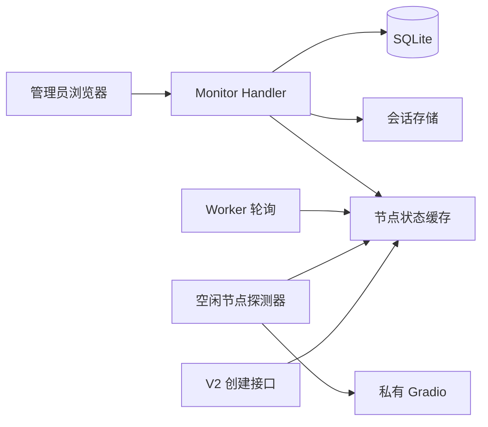

# 监控控制台技术实现方案

| 项目 | 内容 |
| --- | --- |
| 项目名称 | `minimax-h3-tc` |
| 版本/变更 | `001-monitor-console` |
| 设计范围 | Go 管理页面、会话、节点缓存、管理查询、创建前资源判断 |
| 生成日期 | 2026-08-07 |
| 状态 | Draft |

## 1. 架构



- `internal/httpapi/monitor` 提供嵌入式静态页面、会话和只读 JSON API。
- `internal/monitor` 保存线程安全的节点快照。Worker 已有轮询结果优先写入缓存；节点空闲时由采集器每 5 秒调用健康页和 `check_and_get_video` 补充数据，避免重复高频探测。
- SQLite 仍是任务真相源。新增管理员查询方法支持跨客户筛选，使用现有字段和索引，不改变表结构。
- V2 创建处理器只读取缓存中的健康节点数，不等待网络探测。

## 2. 配置

```yaml
admin:
  username: admin
  password: "123"
  session_ttl: 12h
  monitor_interval: 5s
  secure_cookie: false
```

配置支持 `${ENV}` 展开；账号、密码不能为空，时长必须为正数。默认密码仅用于本地测试，启动时检测到默认密码需输出安全警告。

## 3. 节点状态模型

`health` 为 `unknown/healthy/unhealthy`，`runtime` 为 `unknown/idle/running`。快照包含资源百分比、私有队列、最后检查、最后健康、当前任务、最近一条已结束任务及脱敏错误。更新采用整体替换或锁保护，读取返回副本；采集失败保留上次资源值，同时将健康状态和缓存时间明确标记。

解析约定基于 `check_and_get_video`：状态读取结果索引 1、私有队列索引 2、资源索引 3、日志索引 4。解析器必须容忍字段缺失、类型变化和中文文本变化，原始日志只在服务端用于归类。

## 4. 会话与安全

- 密码只保存配置值的内存摘要，使用常量时间比较。
- 登录成功生成 256 位随机会话 ID，服务端仅保存摘要和过期时间；Cookie 设置 `HttpOnly`、`SameSite=Strict`，HTTPS 时设置 `Secure`。
- 会话默认 12 小时，退出立即删除；后台定期清理过期会话。登录接口按来源地址做轻量限速。
- 管理响应设置 `Cache-Control: no-store`；页面不显示真实 API Key、密码、内部结果 URL或原始上游日志。

## 5. 核心流程

### 5.1 采集

1. 服务启动时为每个配置节点建立 `unknown` 快照。
2. 采集器立即执行首次探测，此后每 5 秒刷新。
3. Worker 调用上游时把解析后的状态同步到同一缓存；采集器避免与该节点正在进行的探测重叠。
4. 请求失败时记录中文结构化日志并写入稳定错误码。

### 5.2 创建前判断

1. 完成鉴权、JSON 和业务参数校验。
2. 查询缓存；健康节点数量为 0 时返回 503，不写入 SQLite。
3. 至少一个健康节点时按现有流程创建任务。节点是否忙碌不参与拒绝判断。

## 6. 性能与可靠性

- 快照接口只读内存，目标本机 P95 小于 50 ms；任务列表保持分页查询。
- 单次探测受现有 `request_timeout` 限制，不允许探测 goroutine 无界累积。
- 采集器崩溃不得影响 Worker；缓存为空时采取保守拒绝创建策略，并输出可定位日志。
- 管理页面资源通过 `embed.FS` 编译进二进制，Docker 镜像无需增加前端构建阶段。

## 7. 风险与人工确认

| 类型 | 内容 | 处理 |
| --- | --- | --- |
| 风险 | 私有接口返回结构随版本变化 | 防御性解析、未知值和契约测试 |
| 风险 | 默认管理密码弱 | 生产环境变量覆盖并输出启动警告 |
| 风险 | 资源探测与 Worker 同时调用 | 节点级互斥、复用 Worker 观察值 |
| 人工确认 | 真实私有服务各状态下的返回内容 | 联调时验证资源和错误解析 |
| 人工确认 | HTTPS 反向代理下 Cookie 行为 | 部署环境验收 |
