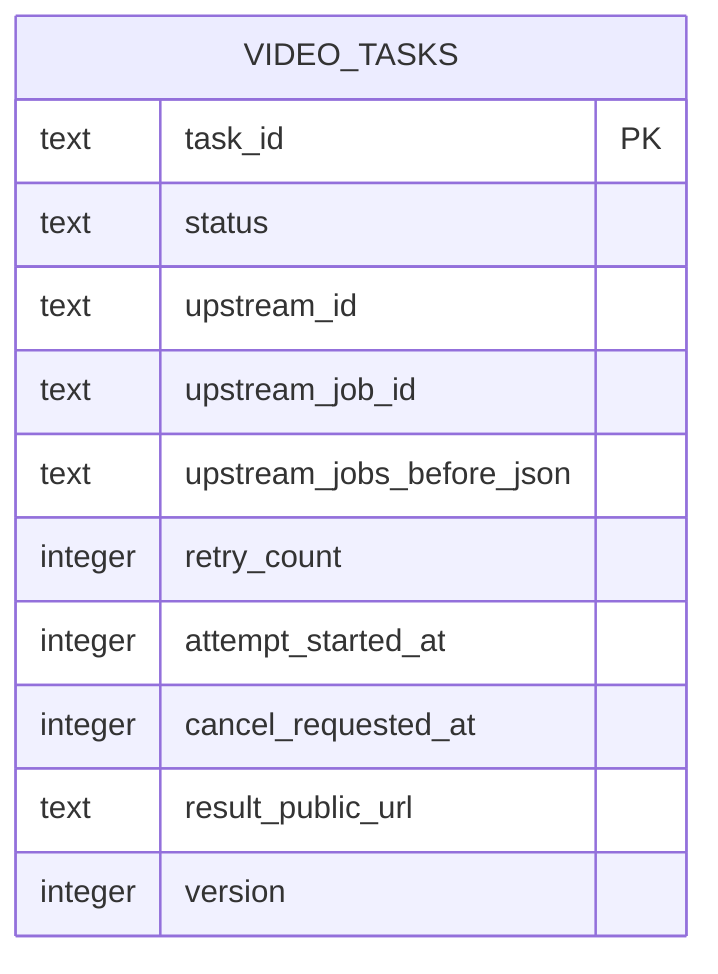

# 任务生命周期闭环数据库增量设计

## 1. 概述

数据库仍为 SQLite，仅修改 `video_tasks`。新增字段用于精确关联私有模型任务、保证最多重试一次、控制单次执行窗口和恢复中止。迁移继续使用嵌入式、单向 SQL；部署前人工备份数据库文件。

## 2. ER 图

## 3. `video_tasks` 新增字段

| 字段 | 类型 | 必填 | 默认值 | 索引 | 说明 |
| --- | --- | --- | --- | --- | --- |
| `upstream_job_id` | TEXT | 否 | NULL | 无 | 私有 Comfy job/prompt UUID |
| `upstream_jobs_before_json` | TEXT | 是 | `'[]'` | 无 | 提交前 job ID 数组，只存 ID |
| `retry_count` | INTEGER | 是 | `0` | 无 | 自动重试次数，CHECK `0..1` |
| `attempt_started_at` | INTEGER | 否 | NULL | 无 | 当前尝试开始 UTC Unix 秒 |
| `cancel_requested_at` | INTEGER | 否 | NULL | 无 | 管理中止请求时间 |

`status` CHECK 增加 `cancelling`。活动实例唯一索引 `uq_video_tasks_active_upstream` 的条件增加 `cancelling`，保证中止收口完成前实例不被再次领取。

## 4. 状态与原子操作

| 操作 | 允许旧状态 | 新状态/变更 | 事务要求 |
| --- | --- | --- | --- |
| 提出中止 | `queued_*` | `cancelled` | `BEGIN IMMEDIATE`，重算保护位 |
| 提出中止 | `dispatching/running/reconciling` | `cancelling` + `cancel_requested_at` | `BEGIN IMMEDIATE` |
| 完成中止 | `cancelling` | `cancelled` + `finished_at` | 条件 UPDATE |
| 关联模型任务 | `dispatching/reconciling` | 写 `upstream_job_id`、`running` | 条件 UPDATE |
| 占用重试 | `reconciling/running` 且 `retry_count=0` | `retry_count=1`、清 job ID、刷新基线和开始时间、`dispatching` | `BEGIN IMMEDIATE` |
| 自动失败 | 活动状态 | `failed` + 稳定错误码 | 条件 UPDATE |
| 管理删除 | `cancelled/succeeded/failed` | 写 `deleted_at` 并删除幂等关系 | `BEGIN IMMEDIATE` |

## 5. 迁移与兼容

- 新增 `migrations/003_task_lifecycle_closure.sql`，通过重建表更新状态 CHECK 和部分唯一索引。
- 现有终态任务直接复制，新字段使用默认值。
- 现有活动任务的 `upstream_job_id` 为空。Worker 恢复时优先绑定实例唯一活动 job，再检查 Gallery；无法绑定时按丢失任务规则处理。
- 不回填历史 job ID，不解析或保存私有完整 job 响应。
- 回滚依赖升级前 SQLite 文件备份与旧二进制，不提供自动 down migration。

## 6. 安全与保留

模型 job ID不是密钥但属于内部关联字段，不在 V2 API 和监控页面中展示。新增字段随任务沿用 7 天逻辑删除策略；Cleaner 行为不变。

## 7. 接口读写映射

| 接口/流程 | 读取字段 | 写入字段 | 事务 |
| --- | --- | --- | --- |
| Worker 提交/对账 | status、job 基线、retry、attempt | job ID、状态、错误、结果 | 短事务 |
| 管理中止 | status、upstream/job ID | status、cancel_requested_at | 是 |
| 管理删除 | status、deleted_at | deleted_at、幂等关系 | 是 |
| 管理列表 | status、retry、result_public_url | 无 | 否 |
