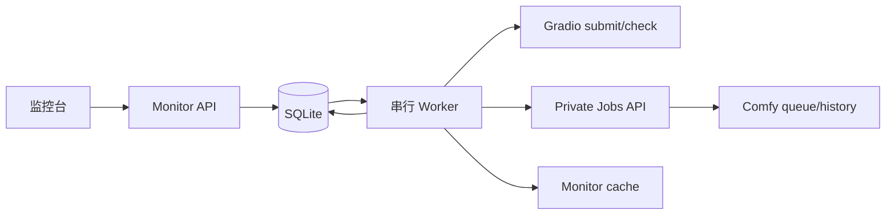
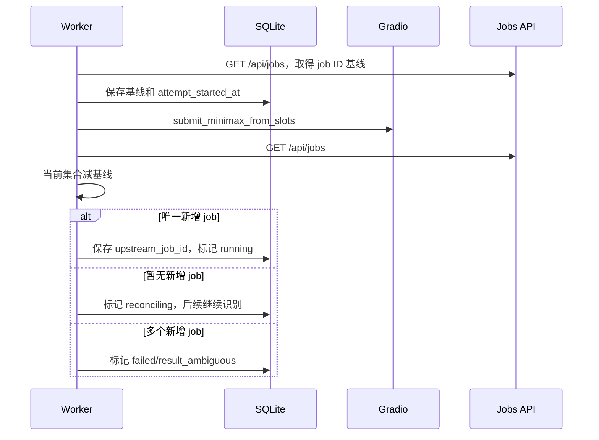
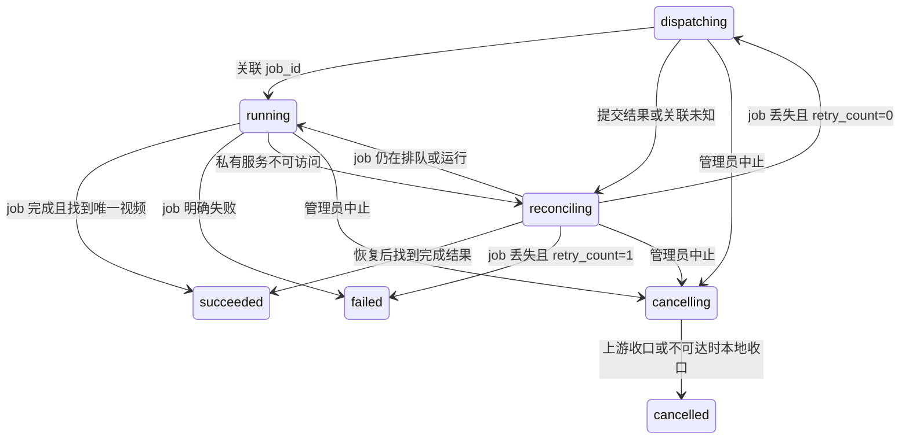

# 任务生命周期闭环技术实现方案

| 项目 | 内容 |
| --- | --- |
| 项目名称 | `minimax-h3-tc` |
| 版本/变更 | `002-task-lifecycle-closure` |
| 设计范围 | Worker、SQLite、Gradio/Jobs 适配、管理接口和监控页面 |
| 生成日期 | 2026-08-10 |
| 状态 | Implemented |

## 1. 设计目标与约束

SQLite 继续作为任务真相源，每个私有实例仍由一个 Worker 独占。私有项目的 Gradio 功能位于编译扩展中，本次不修改该扩展，而是复用私有服务已经提供的 Jobs API。所有网络调用必须位于数据库事务外；状态更新使用预期旧状态和版本条件避免完成、中止、重试竞态。

## 2. 核心概念

| 名词 | 代码名 | 说明 |
| --- | --- | --- |
| 模型任务 ID | `upstream_job_id` | 私有服务 Comfy prompt/job UUID |
| 模型任务基线 | `upstream_jobs_before_json` | 本次提交前已知 job ID 集合，用于提交后差分关联 |
| 自动重试次数 | `retry_count` | 只允许 `0` 或 `1` |
| 单次开始时间 | `attempt_started_at` | 每次提交尝试的 10 分钟保护窗口起点 |
| 中止中 | `cancelling` | 已接受管理中止但 Worker 尚未完成上游收口的内部状态 |

## 3. 模块职责

| 模块 | 职责 | 主要变更 |
| --- | --- | --- |
| `config` | 上游与超时配置 | `upstream.jobs_base_url`、`task.execution_timeout` 默认 `10m` |
| `upstream/gradio` | Gradio 调用和 Jobs API | 列举、查询、取消模型任务，限制响应体并校验 UUID/状态 |
| `store/sqlite` | 状态真相和原子迁移 | 保存关联上下文、领取中止、完成中止、唯一一次重试 |
| `worker` | 执行与恢复编排 | 精确对账、Gallery 结果确认、超时、重试和中止收口 |
| `httpapi/monitor` | 管理能力 | 中止、删除、能力字段和公开视频 URL |
| 监控 Web | 运维交互 | 操作列、二次确认、忙碌态和播放入口 |

## 4. 总体架构

Gradio 和 Jobs API 可以监听不同端口，分别由 `upstream.base_url` 和必填的 `upstream.jobs_base_url` 配置；当前私有服务实测分别为 `7860` 和 `8188`。模型服务返回的 workflow、prompt、输出详情不得写入日志或管理响应。

## 5. 提交与 job_id 关联

由于一个私有实例只允许本中转服务串行提交，唯一集合差分可以将编译 Gradio 扩展创建的 prompt ID关联到本地任务。结果集合包含排队、运行和最近 256 条任务，既覆盖任务快速完成窗口，也限制响应体和 SQLite 基线增长。老数据没有模型任务基线时：优先绑定实例中唯一的排队/运行任务；若没有活动任务则检查 Gallery，仍无结果后进入丢失恢复。

## 6. 轮询、恢复与重试

轮询顺序固定为：

1. 读取本地最新状态；若为 `cancelling`，优先执行中止收口。
2. 查询指定 `upstream_job_id`。
3. `pending/in_progress` 继续等待；`failed/cancelled` 写入对应失败终态；`completed` 再确认结果。
4. 每轮先检查 Gallery 差集，唯一新增视频可以弥补任务刚完成但状态查询短暂失败的窗口。模型 job 已为 `completed` 但 Gallery 尚未更新时，按 3 秒间隔最多再确认 3 次；仍没有唯一结果则失败 `upstream_result_missing`。
5. 服务恢复后指定 job 返回 404，或兼容任务确认实例无活动任务时，最后检查 Gallery。没有结果且 `retry_count=0` 时原子占用唯一重试机会、刷新两个基线并重新提交；`retry_count=1` 时失败 `upstream_task_lost`。
6. 私有服务连续不可访问时保持 `reconciling`，到本次 `attempt_started_at + 10m` 后失败 `upstream_unavailable_timeout`，不在服务不可达时盲目提交。
7. 指定 job 连续 `pending/in_progress` 超过 10 分钟时先精确取消，再失败 `execution_timeout`；超时不触发重试。自动重试只由服务恢复后确认 job 丢失且无结果触发。

重试机会必须在网络提交前持久化，避免前置服务在第二次提交期间重启后再次重试。

## 7. 管理中止闭环

管理接口只负责原子地提出中止：排队任务可直接变为 `cancelled`；已经归属实例的任务变为 `cancelling`，仍计入该实例活动任务，不能提前调度下一条。Worker 每轮读取最新状态，并执行：

- 已知 `job_id`：调用 `POST /api/jobs/{job_id}/cancel`。
- 未知 `job_id`：用提交前后 job 集合差分查找并取消唯一新增任务。
- 私有服务不可达或任务不存在：在 10 分钟保护窗口内持续尝试精确中止，窗口结束后完成本地 `cancelled`。若私有端仍显示运行或队列非空，调度健康门会继续隔离该实例，避免新任务与残留推理并发。
- 完成中止后清理监控缓存当前任务并记录中文结构化日志。

若成功/失败提交与中止并发，最先完成的条件状态更新获胜；另一方收到状态冲突后重新读取终态，不覆盖已有结果。

## 8. 管理页面与接口

任务列表响应新增 `phase`、`retry_count`、`can_cancel`、`can_delete` 和仅公开的 `video_url`。页面依据能力字段渲染操作，不自行复制状态机规则。中止、删除均使用原生确认对话框或现有模态交互二次确认；操作期间禁用当前行按钮，完成后刷新任务和节点快照。

成功任务的播放按钮使用 `target="_blank"` 与 `rel="noopener noreferrer"`。内部结果 URL 永不返回浏览器。

## 9. 安全、日志与可靠性

- 管理写接口沿用现有 HttpOnly 管理会话和 `Cache-Control: no-store`。
- `task_id` 必须按现有任务 ID格式校验；私有 `job_id` 必须为规范 UUID。
- 日志只记录本地 task ID、API Key ID、上游 ID、阶段和稳定错误码，不记录媒体 URL、prompt、请求体或私有响应。
- Jobs API 响应使用现有上游响应体上限，未知状态按协议错误处理。
- 节点采集同时验证 Gradio 和 Jobs API；任一不可用均不接收或调度新任务。
- 精确中止结果不确定时设置调度隔离，只有采集器确认 Gallery 空闲、私有队列为零且 Jobs 无活动任务后才解除。
- 不新增缓存和消息队列；内存监控缓存可以丢失，SQLite 状态可在重启后重建。

## 10. 风险与人工确认

| 类型 | 内容 | 处理方式 |
| --- | --- | --- |
| 风险 | 人工同时向独占实例提交任务会破坏集合差分 | 文档继续声明实例独占；多新增 job 时失败并记录歧义 |
| 风险 | 10 分钟可能小于部分 2K 任务实际耗时 | 按已确认值实现为可配置项，真实模型联调确认 |
| 风险 | 已完成 job 的 Gallery 更新存在短暂延迟 | `completed` 后按 3 秒间隔再确认 3 次，仍无结果则明确失败 |
| 人工确认 | 私有 `/api/jobs` 在 Gradio 提交前后的真实响应 | 使用真实服务执行 t2va/i2va/r2va 联调 |
| 人工确认 | 模型进程崩溃、服务重启和历史清空后的恢复 | Docker/Windows 私有服务故障演练 |
| 人工确认 | 10 分钟阈值对 480P/768P/2K 的适用性 | 记录真实生成耗时后确认配置 |
