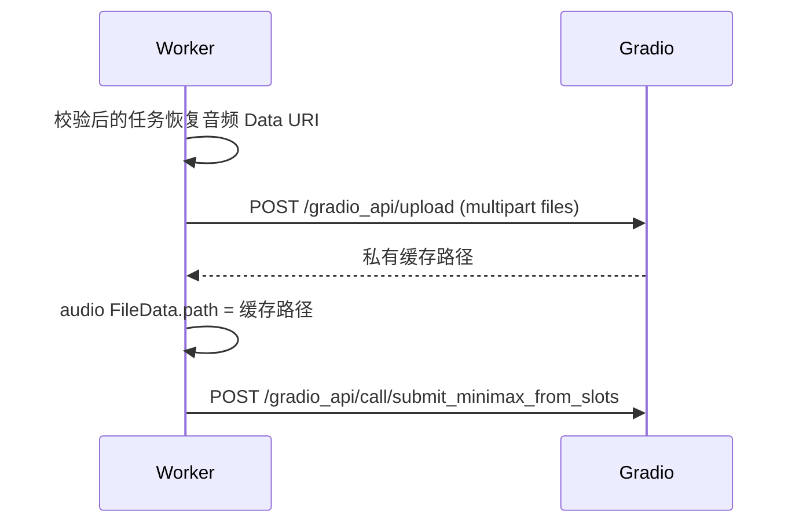

# 音频 Base64 输入技术方案

## 1. 设计结论

前置服务不把 Data URI 直接写入 Gradio 音频 `FileData.url`。Gradio 音频预处理最终需要私有服务本机可读取的文件路径，因此在生成提交前调用其 `/gradio_api/upload` multipart 接口，将解码后的音频换成私有缓存路径，再使用现有 32 槽位映射提交。

HTTP/HTTPS 音频继续直接映射为 `FileData.path`。视频不增加 Base64 支持。图片沿用当前 URL/Data URI 映射，不纳入本次重构。

## 2. 模块变化

| 模块 | 变化 |
| --- | --- |
| `httpapi/v2` | 解析并校验音频 Data URI 的 MIME、Base64 和 15 MiB 限制 |
| `upstream/gradio` | 增加 multipart 上传客户端；在构造参数前替换音频 Data URI 为上传路径 |
| `worker` | 首次提交和唯一重试均调用可选参数准备能力；测试客户端保持兼容 |
| 规格文档 | 更新公开视频生成接口的媒体来源说明 |

## 3. 提交流程

上传在 Gallery 与 Jobs 基线成功取得后、真正提交生成前执行。自动重试会重新上传，避免私有服务重启后旧缓存路径失效。上传失败不会记录输入内容；任务按现有上游提交失败路径进入明确失败或恢复处理。

## 4. 安全与资源约束

- 解码大小在任务入库前限制为 15 MiB，避免后续不受控内存和上传。
- 公共请求体上限维持 64 MiB，可容纳最多 3 段各 15 MiB 的 Base64 音频及 JSON 开销。
- multipart 文件名由服务端按 MIME 生成，不使用调用方路径或名称。
- 上传响应继续受 Gradio 客户端响应体上限保护。
- 不将媒体内容、URL、缓存路径或原始响应写入日志。

## 5. 风险与人工确认

- 需要使用真实私有服务确认 `/gradio_api/upload` 的响应路径可被音频组件读取。
- 当前只根据声明 MIME 和 Base64 结构校验，不探测内容是否确为 WAV/MP3；伪造内容由私有服务拒绝。
- 私有上传缓存的生命周期由 Gradio 管理，前置服务不执行远程删除。
