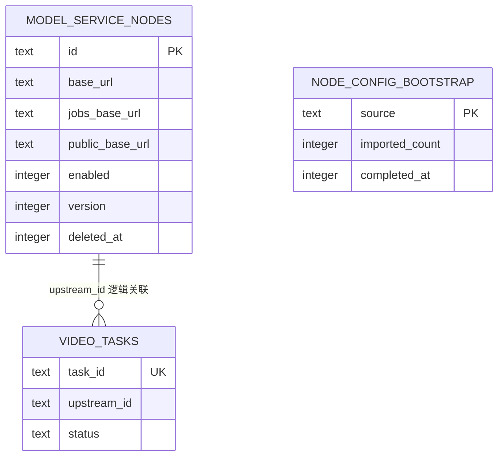

# 管理后台节点配置数据库增量

## 1. 概述

- 设计范围：模型服务节点期望配置、软删除、乐观锁和旧 YAML 一次性导入标记。
- 支撑模块：SQLite Store、节点 Registry、Manager API。
- 数据库类型：现有 SQLite。
- 迁移版本：`004_model_service_nodes.sql`，`schema_migrations.version=4`。
- 关键约束：节点 ID 永不复用；节点配置不与 `video_tasks` 建物理外键；首次导入原子且不可重复。

## 2. 关系图

`video_tasks.upstream_id` 保持现有文本字段，不增加外键。这样节点软删除不会影响历史任务，升级前已有任务也不需要回填。

## 3. 表结构

### 3.1 `model_service_nodes`

表说明：保存模型服务节点的期望配置，是运行时节点的唯一配置真相源。

| 字段 | SQLite 类型 | 必填 | 默认值 | 索引 | 说明 |
| --- | --- | --- | --- | --- | --- |
| `id` | TEXT | 是 | - | PK | 稳定节点 ID，1 至 64 字符，创建后不可修改或复用 |
| `base_url` | TEXT | 是 | - | - | Gradio 完整 HTTP/HTTPS 基础地址 |
| `jobs_base_url` | TEXT | 是 | - | - | Jobs API 完整 HTTP/HTTPS 基础地址 |
| `public_base_url` | TEXT | 是 | - | - | 公开视频完整 HTTP/HTTPS 基础地址 |
| `health_path` | TEXT | 是 | `/` | - | Gradio 健康检查路径，以 `/` 开头 |
| `submit_api_name` | TEXT | 是 | `submit_minimax_from_slots` | - | Gradio 提交函数名 |
| `check_api_name` | TEXT | 是 | `check_and_get_video` | - | Gradio结果查询函数名 |
| `poll_interval_ms` | INTEGER | 是 | `3000` | - | Worker 轮询间隔，1000 至 300000 毫秒 |
| `request_timeout_ms` | INTEGER | 是 | `30000` | - | 单次上游请求超时，1000 至 300000 毫秒 |
| `enabled` | INTEGER | 是 | `1` | 部分索引 | `0` 停用，`1` 启用 |
| `version` | INTEGER | 是 | `1` | - | 乐观锁版本，每次更新加一 |
| `created_at` | INTEGER | 是 | - | - | Unix 秒 |
| `updated_at` | INTEGER | 是 | - | - | Unix 秒 |
| `deleted_at` | INTEGER | 否 | `NULL` | 部分索引 | 软删除 Unix 秒 |

约束：

- `CHECK(length(id) BETWEEN 1 AND 64)`；字符集由应用层正则和 Store 测试共同保证。
- 三个 URL、路径和接口名不能为空。
- `CHECK(poll_interval_ms BETWEEN 1000 AND 300000)`。
- `CHECK(request_timeout_ms BETWEEN 1000 AND 300000)`。
- `CHECK(enabled IN (0,1))`、`CHECK(version >= 1)`。
- 主键覆盖软删除记录，因此删除后同名 ID 不可重新创建。

索引设计：

| 索引名 | 字段 | 类型 | 目的 |
| --- | --- | --- | --- |
| `sqlite_autoindex_model_service_nodes_1` | `id` | 主键唯一 | 单节点读取、更新和永久 ID 保留 |
| `idx_model_service_nodes_active` | `enabled, id` | 部分普通，`WHERE deleted_at IS NULL` | Registry 和管理列表读取未删除节点 |

### 3.2 `node_config_bootstrap`

表说明：记录外部旧配置源的一次性迁移完成事实，避免节点全部删除后再次从 YAML 导入。

| 字段 | SQLite 类型 | 必填 | 默认值 | 索引 | 说明 |
| --- | --- | --- | --- | --- | --- |
| `source` | TEXT | 是 | - | PK | 当前固定为 `yaml_upstreams` |
| `imported_count` | INTEGER | 是 | `0` | - | 首次事务实际导入的节点数 |
| `completed_at` | INTEGER | 是 | - | - | 完成时间 Unix 秒 |

约束：

- `CHECK(source='yaml_upstreams')`。
- `CHECK(imported_count >= 0)`。

## 4. Store 操作与事务

| 操作 | 读取表 | 写入表 | 事务边界 | 并发条件 |
| --- | --- | --- | --- | --- |
| 首次导入 | 两张新表 | 两张新表 | 一个事务，全量插入和标记同时提交 | 标记不存在；节点表为空才导入 |
| 节点列表/读取 | `model_service_nodes` | 无 | 无显式事务 | `deleted_at IS NULL` |
| 创建节点 | `model_service_nodes` | `model_service_nodes` | 单事务 | ID 不存在，包括软删除记录 |
| 更新节点 | 节点表、`video_tasks` | 节点表 | 一个事务 | 版本匹配；活动任务规则通过 |
| 删除节点 | 节点表、`video_tasks` | 节点表 | 一个事务 | 已停用且无活动任务 |
| Registry 对账 | 节点表 | 无 | 只读快照 | 按 `id` 排序并比较 `version` |
| 领取新任务 | 节点表、`video_tasks` | `video_tasks` | 一个 immediate 事务 | 节点未删除、启用且版本与运行槽一致 |

活动任务沿用 `video_tasks.status IN ('dispatching','running','reconciling','cancelling') AND deleted_at IS NULL`。检查活动任务和更新/删除必须使用同一数据库连接事务，禁止先查后写。

`ClaimNext` 增加预期节点版本参数。配置更新/停用/删除与 Claim 由 SQLite 写事务串行化：先 Claim 则配置写操作因活动任务失败；先变更配置则旧槽因节点版本或启用条件不匹配而无法 Claim。恢复已归属任务继续按 `upstream_id` 查询，不受 `enabled` 限制。

## 5. 首次导入算法

1. 开始写事务并查询 `source='yaml_upstreams'`。
2. 标记已存在则提交空操作并返回“已完成”，不解析 YAML。
3. 查询 `model_service_nodes` 总记录数，包括软删除记录。
4. 表非空时不合并 YAML，只插入 `imported_count=0` 的完成标记。
5. 表为空时，在事务外完成旧 YAML 的 URL、ID、时长和重复项校验，再在事务内插入全部节点。
6. 插入 `node_config_bootstrap`，其 `imported_count` 为实际插入数，并提交。
7. 任意插入失败则回滚；标记不存在，下次启动可重试。

为避免在数据库事务中解析复杂配置，Store 可先通过 `BootstrapState` 查询是否待导入；解析完成后调用 `ImportLegacyNodes`，该方法再次在事务内检查标记和节点表，防止竞态。

## 6. 软删除与历史关系

- 删除只写 `deleted_at`、`updated_at` 并增加 `version`，不物理删除。
- 管理列表和 Registry 默认排除软删除节点。
- 历史任务继续展示原 `upstream_id`；不要求节点记录仍可见。
- 当前任务清理由 Worker 正常完成；API 不允许删除存在活动任务的节点。
- 本次不增加节点记录自动清理，防止历史 ID 被误复用。

## 7. 安全与数据保护

- URL 不允许包含用户凭据、查询参数或片段；应用层写入前使用结构化 URL 解析。
- 当前字段不包含认证密钥，不引入应用层加密；SQLite 文件和挂载卷必须限制为服务账户访问。
- 管理接口可以向已认证管理员返回完整配置以支持编辑，但日志、错误和监控快照只返回节点 ID或主机显示值，不记录完整 URL。
- 不保存连接测试响应体、私有任务列表或模型服务页面内容。

## 8. 迁移与回滚

- v4 DDL 只新增表和索引，可在现有数据库原地执行。
- 旧节点数据导入属于启动期业务迁移，不写入 SQL migration，因为来源来自 YAML。
- 回滚旧二进制时新表被忽略；原 YAML 应保留到发布回滚窗口结束。
- 不提供自动 DDL 回滚，避免误删管理员已经写入的节点配置。

## 9. 性能检查

- 节点规模预期为个位数至几十个，管理列表不分页，Registry 每次全量读取未删除节点。
- 对账查询使用部分索引并按 ID 排序；不会扫描任务请求 JSON。
- 节点写操作低频，继续适配当前 `MaxOpenConns(1)` SQLite 模式。
- 活动任务查询已有 `uq_video_tasks_active_upstream` 部分唯一索引，可支撑更新和删除前检查。

## 10. 待确认项

暂无影响实现的数据库决策待确认。真实生产数据库升级前需按现有发布流程备份 SQLite 文件，该动作保留为人工发布检查。
