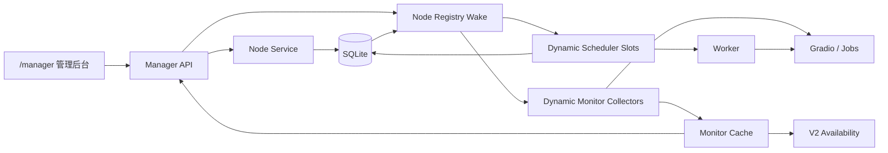
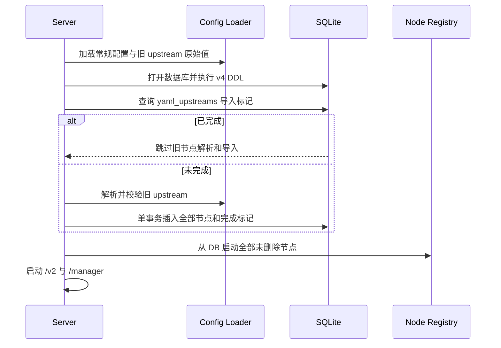
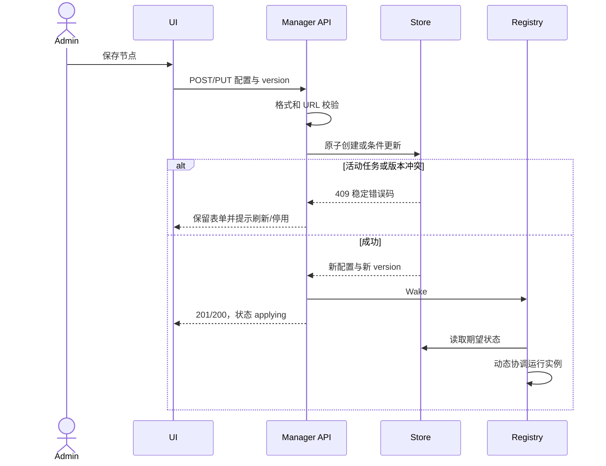

# 管理后台与动态节点技术实现方案

| 项目 | 内容 |
| --- | --- |
| 项目名称 | `minimax-h3-tc` |
| 版本/变更 | `004-manager-node-configuration` |
| 设计范围 | 配置加载、SQLite、动态节点运行时、调度器、监控采集、管理 API 与页面 |
| 生成日期 | 2026-08-11 |
| 状态 | Draft |

## 1. 背景与目标

当前 `cmd/server` 从 YAML 读取固定 `[]UpstreamConfig`，随后一次性构建监控缓存、调度槽、Worker 和采集器。该结构无法在服务运行期间增删节点。本方案将节点的期望配置迁移到 SQLite，并增加单进程节点注册器，将数据库配置动态协调到现有 Worker、调度和采集组件。

设计目标：

- `/monitor` 升级为 `/manager`，保留原任务管理和节点监控能力。
- 节点配置由 SQLite 持久化，并可通过管理后台运行时更新。
- 配置变化不能打断已归属任务，不能让停用或未健康节点领取新任务。
- 现有 YAML 节点一次性无损导入，之后不再成为运行配置源。
- 服务允许零节点启动，保证管理员始终可以进入后台恢复配置。

不在本次范围：多进程协调、细粒度 RBAC、通用配置中心、私有服务改造。

## 2. 核心概念

| 名词 | 代码名 | 说明 | 适用范围 | 备注 |
| --- | --- | --- | --- | --- |
| 节点期望配置 | `ModelNode` | SQLite 中管理员期望的连接和启停配置 | Store/Manager | 唯一真相源 |
| 节点运行实例 | `RuntimeNode` | 客户端、Gate、Worker 槽和采集协程的内存组合 | Runtime Registry | 可重建，不持久化 |
| 配置版本 | `version` | 节点记录的乐观锁版本 | API/Store | 更新成功后加一 |
| 停用排空 | `disabled draining` | 不领取新任务，但继续处理已归属活动任务 | Scheduler/Worker | 重启后仍可恢复 |
| 首次导入标记 | `yaml_upstreams` | 证明旧 YAML 导入流程已完成 | SQLite/Config | 防止节点全删后再次导入 |

## 3. 模块设计

| 模块 | 职责 | 核心变化 | 上游依赖 | 下游依赖 |
| --- | --- | --- | --- | --- |
| `internal/config` | 加载非节点配置和旧 YAML 原始节点 | 拆分常规校验与仅首次执行的旧节点解析 | YAML/环境变量 | Bootstrap |
| `internal/store/sqlite` | 节点配置真相、导入和并发控制 | 新增节点 CRUD、乐观锁、软删除和导入事务 | SQLite | Registry/Manager API |
| `internal/upstream/registry` | 协调数据库期望状态和内存运行实例 | 按节点版本动态启动、替换、排空和停止实例 | Store | Scheduler/Collector/Cache |
| `internal/scheduler` | 每节点串行领取和执行任务 | 支持运行时注册/移除槽；停用节点只处理活动任务 | Registry/Store | Worker |
| `internal/monitor` | 节点采集与快照 | 支持动态采集和缓存删除，快照包含启停/应用状态 | Registry/Gradio | Manager/V2 availability |
| `internal/httpapi/manager` | 管理会话、任务和节点接口 | 由 monitor 包迁移，新增节点 CRUD/测试接口 | Store/Registry/Cache | Web UI |
| `cmd/server` | 进程装配 | 先迁移和导入，再启动 Registry；允许零节点 | Config/Store | HTTP/后台协程 |

## 4. 总体架构

SQLite 保存期望配置和业务任务；Registry 仅保存可丢失的运行句柄。管理写接口提交数据库后唤醒 Registry，Registry 也按固定短间隔兜底对账，避免一次内存通知丢失造成配置永久不生效。

## 5. 启动与首次导入

实现约束：

1. `config.Load` 不再要求至少一个上游，只保存旧 `upstreams` 的原始结构；只有导入未完成时才转换为 `UpstreamConfig` 并执行 URL/重复 ID 校验。
2. 导入事务先确认节点表为空。若表已有记录，则只写完成标记，不合并 YAML，避免双来源覆盖。
3. 合法旧节点全部插入并默认启用；任意一条无效时不写节点、不写标记，启动失败后允许修正并重试。
4. YAML 没有节点时仍写完成标记并以零节点启动。
5. 标记存在后不解析节点 URL，因此后续删除或修改旧 YAML 不影响启动；日志只记录忽略数量，不记录地址。

## 6. 动态节点协调

Registry 使用 `node_id -> runtimeEntry` 映射，每个条目记录已应用的数据库版本、上下文取消函数、结束通知、Gradio 客户端和共享 Gate。协调周期比较数据库记录与运行条目：

- 新增：创建未知状态缓存，启动采集和调度槽；首次健康检查前不可调度。
- 配置版本变化：取消旧采集/槽并等待退出，再用新配置重建。连接参数更新在 API 层已保证没有活动任务。
- 停用：采集继续运行；调度健康门在无活动任务时拒绝领取，在有活动任务时允许 Worker 继续恢复、轮询或中止。
- 重新启用：立即唤醒协调和采集，健康新鲜后恢复领取。
- 软删除：停止运行条目并从监控缓存移除；历史任务仍保留原 `upstream_id` 文本。
- 单次协调失败：记录节点 ID、阶段和稳定错误码，保留数据库期望状态并在下个周期重试，不回滚已提交配置。

Registry 的 `Wake` 只用于降低生效延迟，正确性由周期对账保证。进程关闭时先取消根上下文，等待节点协程退出，再关闭 HTTP 服务和数据库。

每个调度槽携带创建它的节点 `version`。Worker 领取新任务时调用带 `node_id + version` 的 Claim，SQLite 在同一事务确认节点仍未删除、仍启用且版本匹配后才允许写入 `upstream_id`。这样配置更新、停用或删除与领取并发时：Claim 先完成则配置写操作看到活动任务并冲突；配置写操作先完成则旧槽得到配置过期结果并停止领取。活动任务恢复不使用该启用条件，确保停用排空仍可继续。

## 7. 节点写入流程与并发

更新规则：

- 节点 ID 不可修改，软删除后不可复用。
- 全量 `PUT` 必须携带当前 `version`，Store 使用 `WHERE id=? AND version=? AND deleted_at IS NULL`。
- 有活动任务时，仅接受“其他字段完全相同且 `enabled: true -> false`”的停用请求。
- 修改 URL、接口名、间隔或重新启用均要求该节点没有活动任务。
- 删除要求节点已停用且没有活动任务。Store 在同一事务中检查并写 `deleted_at`，避免检查与删除竞态。
- 创建、更新和删除不在数据库事务内进行网络调用；连接测试是独立只读接口，不改变配置。

## 8. 调度、监控与任务安全

Scheduler 由固定切片改为线程安全的动态槽集合。每个槽仍保持一个串行循环和一个共享 Gate，延续“一节点最多一个本服务任务”。动态删除槽前必须取消上下文并等待循环退出，避免旧配置和新配置同时领取。

节点可领取条件为：

1. 数据库配置 `enabled=true`；
2. 没有该节点活动任务；
3. Gradio 与 Jobs 健康检查均成功且快照未过期；
4. 私有队列为空、运行态为空闲、未处于调度隔离。

最终领取事务还必须校验节点 `enabled=true`、`deleted_at IS NULL` 且 `version` 与当前槽一致，健康门只用于减少无效尝试，不能承担并发正确性。

节点已停用但存在 `dispatching/running/reconciling/cancelling` 任务时，Worker 优先处理该活动任务，不执行新的 Claim。前置服务重启后，Registry 仍为停用节点建立恢复用运行条目，直到活动任务进入终态。

监控缓存新增 `Enabled` 和 `Applying`。健康汇总不把停用节点计为异常；V2 `Available` 只统计启用且健康新鲜的节点。节点配置被替换时先把快照重置为未知和应用中，不能沿用旧地址的健康结果。

## 9. 路径与会话迁移

- Go 包从 `internal/httpapi/monitor` 迁移为 `internal/httpapi/manager`；监控采集领域包 `internal/monitor` 保持不变。
- 页面、资源和 API 使用 `/manager`、`/manager/login`、`/manager/assets/*`、`/manager/api/*`。
- 会话 Cookie 改名为 `manager_session`，Path 为 `/manager`，继续使用 HttpOnly、SameSite=Strict 和现有 Secure 配置。
- `GET /monitor`、`GET /monitor/`、`GET /monitor/login` 返回 308 到对应新页面；旧 `/monitor/api/*` 不提供写接口别名，避免跨路径 Cookie 和重定向方法语义不明确。
- 升级后旧会话自然失效，需要重新登录；这属于明确的一次性兼容影响。

## 10. 接口与数据库摘要

管理后台共有 11 个接口：原 6 个会话/快照/任务接口换到 `/manager`，新增节点列表、创建、更新、删除和草稿连接测试 5 个接口。详细契约见 `API_DELTA.md` 与 `api-modules/manager-nodes.md`。

新增两张表：

| 表 | 说明 | 核心字段 | 关键索引 |
| --- | --- | --- | --- |
| `model_service_nodes` | 节点期望配置和启停状态 | `id`、三个 URL、接口名、间隔、`enabled`、`version` | 主键、启用节点部分索引 |
| `node_config_bootstrap` | 一次性导入完成标记 | `source`、`imported_count`、`completed_at` | 主键 |

详细结构与迁移见 `DATABASE_DELTA.md`。

## 11. 安全与可靠性

- 节点接口沿用管理会话、`Cache-Control: no-store`、JSON 请求体限制和严格未知字段拒绝。
- 节点 URL 禁止凭据、查询参数和片段；日志和通用错误不输出 URL。
- 本次不新增节点密码字段，因此 SQLite 不引入新的加密密钥。数据库文件仍依赖主机和容器卷权限保护。
- 写操作使用乐观锁；运行时协调使用版本幂等，重复 Wake 和重启不会重复创建并发槽。
- DB 写成功、运行时暂时应用失败时，API 不伪造健康状态；Registry 自动重试，UI 显示应用中或异常。
- 节点 Store 的状态检查与写入在一个事务内，网络探测和协程等待始终在事务外。
- 结构化日志记录 `node_id`、`action`、`stage`、`error_code` 和配置版本，不记录私有地址、媒体、prompt 或原始请求。

## 12. 回滚与发布约束

- v4 数据库迁移仅新增表，不修改 `video_tasks`，旧二进制可以忽略新增表。
- 在版本回滚窗口结束前保留原 YAML `upstreams`；回滚到旧二进制时它仍是旧版本唯一节点来源。
- 新版本导入完成后，管理后台对节点的修改不会回写 YAML，因此回滚前必须人工确认 YAML 是否仍代表可接受的旧版本配置。
- 不支持同时运行新旧两个前置服务进程共享同一 SQLite；这是现有单进程部署约束的延续。

## 13. 风险与人工确认

| 类型 | 内容 | 影响 | 处理方式 |
| --- | --- | --- | --- |
| 风险 | DB 已提交但运行时协调短暂失败 | 节点配置显示已保存但尚不可用 | 显示应用中，周期对账自动重试 |
| 风险 | 停用节点的活动任务跨进程重启 | 若不启动 Worker 会永久卡住 | Registry 为有活动任务的停用节点保留恢复槽 |
| 风险 | 回滚时 YAML 已过期 | 旧二进制使用错误节点 | 发布说明要求回滚窗口保留并核对 YAML |
| 假设 | 单前置服务进程独占 SQLite | 无需跨进程通知和租约 | 继续按当前部署模型实现 |
| 人工确认 | 真实节点新增、修改、停用和重新启用 | 验证热更新与私有服务兼容 | 测试/运维在 Docker 环境执行 |
| 人工确认 | 有运行任务时停用并重启前置服务 | 验证任务继续闭环 | 测试/运维执行故障演练 |
