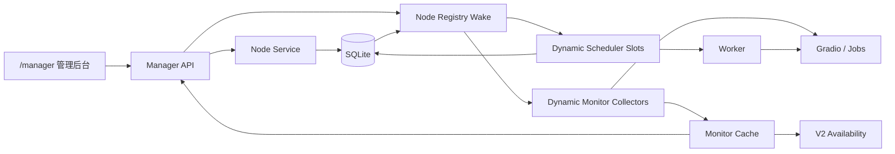
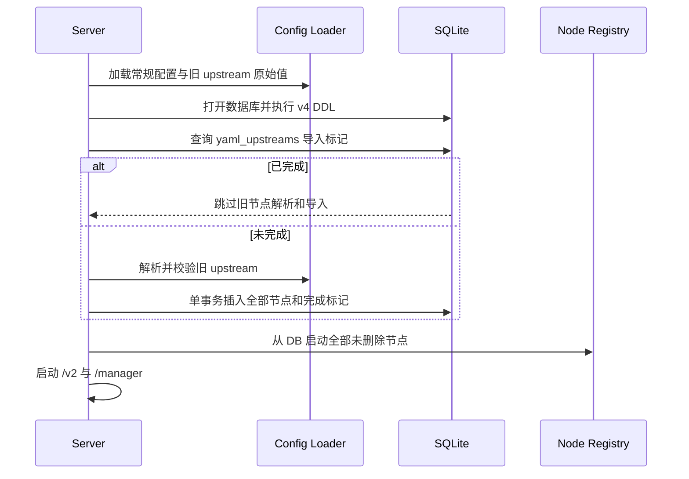
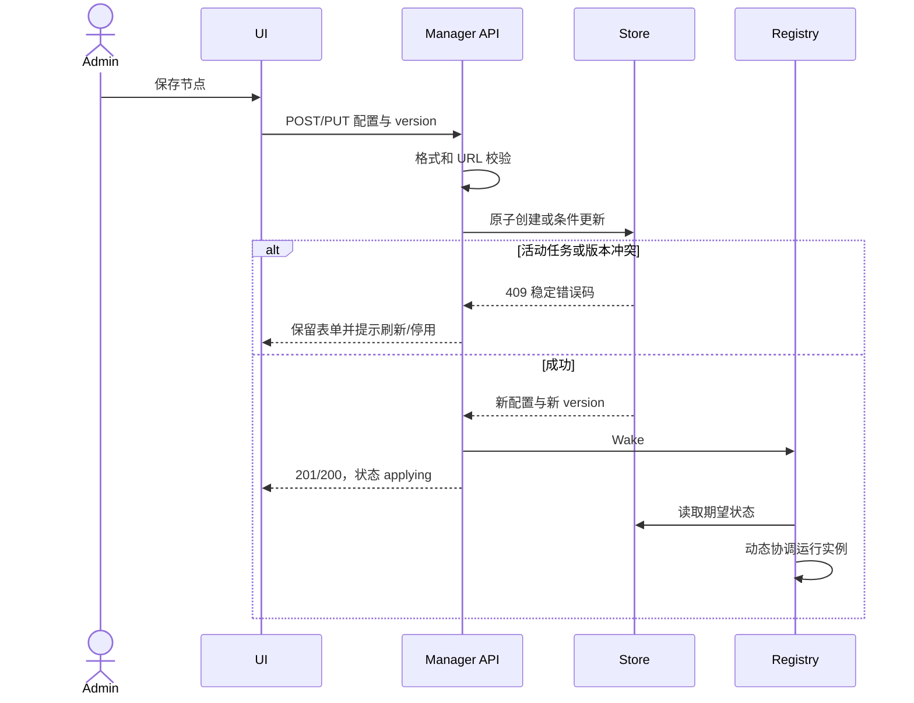
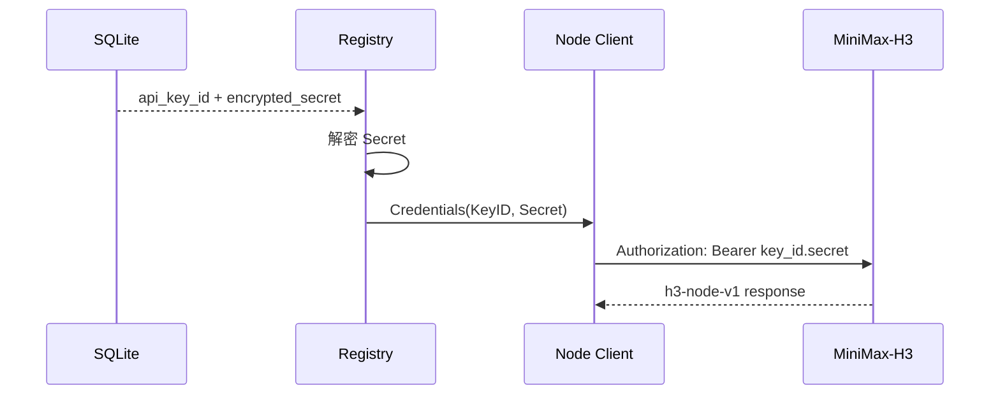
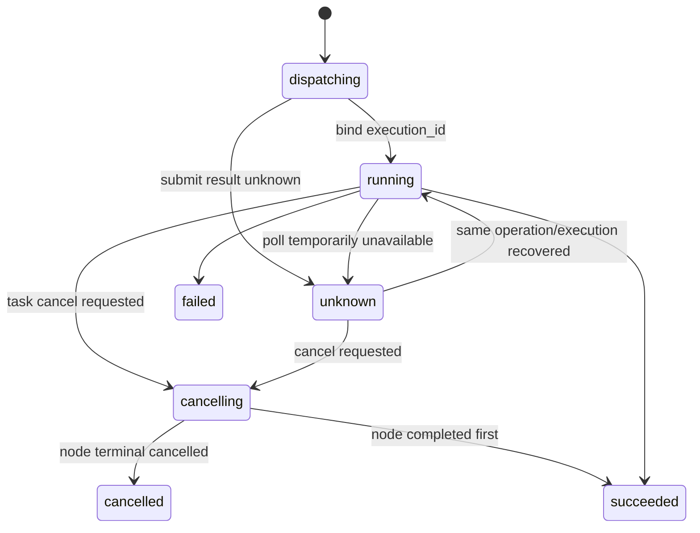
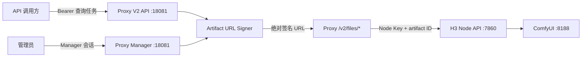
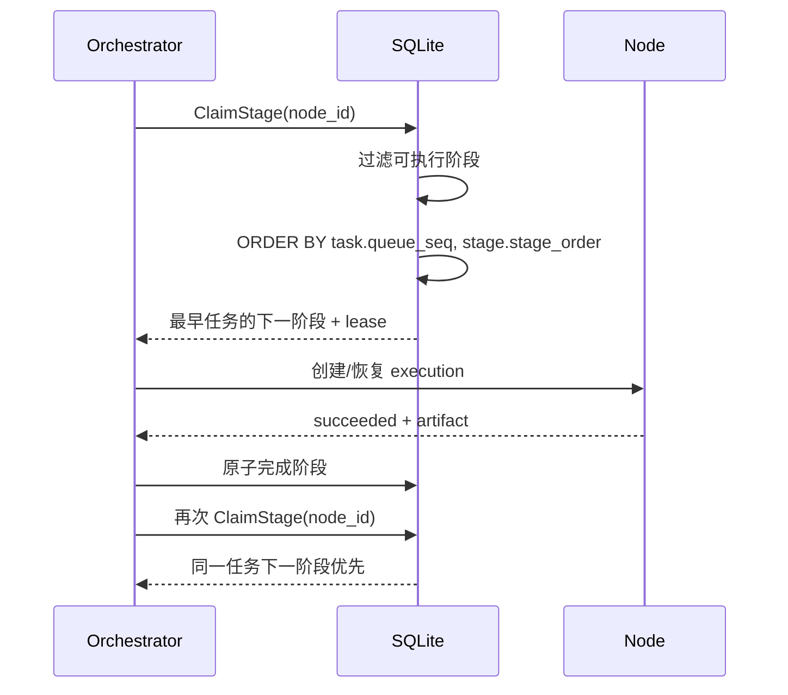

# 管理后台与动态节点技术实现方案

> Node 凭据技术方案已被 `006-node-single-key-conf` 取代：Proxy 解密单 Key 后直接发送 `Authorization: Bearer <key>`，不再组装 Key ID 或检查 scope。

| 项目 | 内容 |
| --- | --- |
| 项目名称 | `minimax-h3-tc` |
| 版本/变更 | `004-manager-node-configuration` |
| 设计范围 | 配置加载、SQLite、动态节点运行时、调度器、监控采集、管理 API 与页面 |
| 生成日期 | 2026-08-11 |
| 状态 | Draft |

## 1. 背景与目标

当前 `cmd/server` 从 YAML 读取固定 `[]UpstreamConfig`，随后一次性构建监控缓存、调度槽、Worker 和采集器。该结构无法在服务运行期间增删节点。本方案将节点的期望配置迁移到 SQLite，并增加单进程节点注册器，将数据库配置动态协调到现有 Worker、调度和采集组件。

设计目标：

- `/monitor` 升级为 `/manager`，保留原任务管理和节点监控能力。
- 节点配置由 SQLite 持久化，并可通过管理后台运行时更新。
- 配置变化不能打断已归属任务，不能让停用或未健康节点领取新任务。
- 现有 YAML 节点一次性无损导入，之后不再成为运行配置源。
- 服务允许零节点启动，保证管理员始终可以进入后台恢复配置。

不在本次范围：多进程协调、细粒度 RBAC、通用配置中心和私有模型工作流改造；Node 侧仅做统一错误、授权能力和契约快照兼容修复。

## 2. 核心概念

| 名词 | 代码名 | 说明 | 适用范围 | 备注 |
| --- | --- | --- | --- | --- |
| 节点期望配置 | `ModelNode` | SQLite 中管理员期望的连接和启停配置 | Store/Manager | 唯一真相源 |
| 节点运行实例 | `RuntimeNode` | 客户端、Gate、Worker 槽和采集协程的内存组合 | Runtime Registry | 可重建，不持久化 |
| 配置版本 | `version` | 节点记录的乐观锁版本 | API/Store | 更新成功后加一 |
| 停用排空 | `disabled draining` | 不领取新任务，但继续处理已归属活动任务 | Scheduler/Worker | 重启后仍可恢复 |
| 首次导入标记 | `yaml_upstreams` | 证明旧 YAML 导入流程已完成 | SQLite/Config | 防止节点全删后再次导入 |

## 3. 模块设计

| 模块 | 职责 | 核心变化 | 上游依赖 | 下游依赖 |
| --- | --- | --- | --- | --- |
| `internal/config` | 加载非节点配置和旧 YAML 原始节点 | 拆分常规校验与仅首次执行的旧节点解析 | YAML/环境变量 | Bootstrap |
| `internal/store/sqlite` | 节点配置真相、导入和并发控制 | 新增节点 CRUD、乐观锁、软删除和导入事务 | SQLite | Registry/Manager API |
| `internal/upstream/registry` | 协调数据库期望状态和内存运行实例 | 按节点版本动态启动、替换、排空和停止实例 | Store | Scheduler/Collector/Cache |
| `internal/scheduler` | 每节点串行领取和执行任务 | 支持运行时注册/移除槽；停用节点只处理活动任务 | Registry/Store | Worker |
| `internal/monitor` | 节点采集与快照 | 支持动态采集和缓存删除，快照包含启停/应用状态 | Registry/Gradio | Manager/V2 availability |
| `internal/httpapi/manager` | 管理会话、任务和节点接口 | 由 monitor 包迁移，新增节点 CRUD/测试接口 | Store/Registry/Cache | Web UI |
| `cmd/server` | 进程装配 | 先迁移和导入，再启动 Registry；允许零节点 | Config/Store | HTTP/后台协程 |

## 4. 总体架构



SQLite 保存期望配置和业务任务；Registry 仅保存可丢失的运行句柄。管理写接口提交数据库后唤醒 Registry，Registry 也按固定短间隔兜底对账，避免一次内存通知丢失造成配置永久不生效。

## 5. 启动与首次导入



实现约束：

1. `config.Load` 不再要求至少一个上游，只保存旧 `upstreams` 的原始结构；只有导入未完成时才转换为 `UpstreamConfig` 并执行 URL/重复 ID 校验。
2. 导入事务先确认节点表为空。若表已有记录，则只写完成标记，不合并 YAML，避免双来源覆盖。
3. 合法旧节点全部插入并默认启用；任意一条无效时不写节点、不写标记，启动失败后允许修正并重试。
4. YAML 没有节点时仍写完成标记并以零节点启动。
5. 标记存在后不解析节点 URL，因此后续删除或修改旧 YAML 不影响启动；日志只记录忽略数量，不记录地址。

## 6. 动态节点协调

Registry 使用 `node_id -> runtimeEntry` 映射，每个条目记录已应用的数据库版本、上下文取消函数、结束通知、Gradio 客户端和共享 Gate。协调周期比较数据库记录与运行条目：

- 新增：创建未知状态缓存，启动采集和调度槽；首次健康检查前不可调度。
- 配置版本变化：取消旧采集/槽并等待退出，再用新配置重建。连接参数更新在 API 层已保证没有活动任务。
- 停用：采集继续运行；调度健康门在无活动任务时拒绝领取，在有活动任务时允许 Worker 继续恢复、轮询或中止。
- 重新启用：立即唤醒协调和采集，健康新鲜后恢复领取。
- 软删除：停止运行条目并从监控缓存移除；历史任务仍保留原 `upstream_id` 文本。
- 单次协调失败：记录节点 ID、阶段和稳定错误码，保留数据库期望状态并在下个周期重试，不回滚已提交配置。

Registry 的 `Wake` 只用于降低生效延迟，正确性由周期对账保证。进程关闭时先取消根上下文，等待节点协程退出，再关闭 HTTP 服务和数据库。

每个调度槽携带创建它的节点 `version`。Worker 领取新任务时调用带 `node_id + version` 的 Claim，SQLite 在同一事务确认节点仍未删除、仍启用且版本匹配后才允许写入 `upstream_id`。这样配置更新、停用或删除与领取并发时：Claim 先完成则配置写操作看到活动任务并冲突；配置写操作先完成则旧槽得到配置过期结果并停止领取。活动任务恢复不使用该启用条件，确保停用排空仍可继续。

## 7. 节点写入流程与并发



更新规则：

- 节点 ID 不可修改，软删除后不可复用。
- 全量 `PUT` 必须携带当前 `version`，Store 使用 `WHERE id=? AND version=? AND deleted_at IS NULL`。
- 有活动任务时，仅接受“其他字段完全相同且 `enabled: true -> false`”的停用请求。
- 修改 URL、接口名、间隔或重新启用均要求该节点没有活动任务。
- 删除要求节点已停用且没有活动任务。Store 在同一事务中检查并写 `deleted_at`，避免检查与删除竞态。
- 创建、更新和删除不在数据库事务内进行网络调用；连接测试是独立只读接口，不改变配置。

## 8. 调度、监控与任务安全

Scheduler 由固定切片改为线程安全的动态槽集合。每个槽仍保持一个串行循环和一个共享 Gate，延续“一节点最多一个本服务任务”。动态删除槽前必须取消上下文并等待循环退出，避免旧配置和新配置同时领取。

节点可领取条件为：

1. 数据库配置 `enabled=true`；
2. 没有该节点活动任务；
3. Gradio 与 Jobs 健康检查均成功且快照未过期；
4. 私有队列为空、运行态为空闲、未处于调度隔离。

最终领取事务还必须校验节点 `enabled=true`、`deleted_at IS NULL` 且 `version` 与当前槽一致，健康门只用于减少无效尝试，不能承担并发正确性。

节点已停用但存在 `dispatching/running/reconciling/cancelling` 任务时，Worker 优先处理该活动任务，不执行新的 Claim。前置服务重启后，Registry 仍为停用节点建立恢复用运行条目，直到活动任务进入终态。

监控缓存新增 `Enabled` 和 `Applying`。健康汇总不把停用节点计为异常；V2 `Available` 只统计启用且健康新鲜的节点。节点配置被替换时先把快照重置为未知和应用中，不能沿用旧地址的健康结果。

## 9. 路径与会话迁移

- Go 包从 `internal/httpapi/monitor` 迁移为 `internal/httpapi/manager`；监控采集领域包 `internal/monitor` 保持不变。
- 页面、资源和 API 使用 `/manager`、`/manager/login`、`/manager/assets/*`、`/manager/api/*`。
- 会话 Cookie 改名为 `manager_session`，Path 为 `/manager`，继续使用 HttpOnly、SameSite=Strict 和现有 Secure 配置。
- `GET /monitor`、`GET /monitor/`、`GET /monitor/login` 返回 308 到对应新页面；旧 `/monitor/api/*` 不提供写接口别名，避免跨路径 Cookie 和重定向方法语义不明确。
- 升级后旧会话自然失效，需要重新登录；这属于明确的一次性兼容影响。

## 10. 接口与数据库摘要

管理后台共有 11 个接口：原 6 个会话/快照/任务接口换到 `/manager`，新增节点列表、创建、更新、删除和草稿连接测试 5 个接口。详细契约见 `API_DELTA.md` 与 `api-modules/manager-nodes.md`。

新增两张表：

| 表 | 说明 | 核心字段 | 关键索引 |
| --- | --- | --- | --- |
| `model_service_nodes` | 节点期望配置和启停状态 | `id`、三个 URL、接口名、间隔、`enabled`、`version` | 主键、启用节点部分索引 |
| `node_config_bootstrap` | 一次性导入完成标记 | `source`、`imported_count`、`completed_at` | 主键 |

详细结构与迁移见 `DATABASE_DELTA.md`。

## 11. 安全与可靠性

- 节点接口沿用管理会话、`Cache-Control: no-store`、JSON 请求体限制和严格未知字段拒绝。
- 节点 URL 禁止凭据、查询参数和片段；日志和通用错误不输出 URL。
- 本次不新增节点密码字段，因此 SQLite 不引入新的加密密钥。数据库文件仍依赖主机和容器卷权限保护。
- 写操作使用乐观锁；运行时协调使用版本幂等，重复 Wake 和重启不会重复创建并发槽。
- DB 写成功、运行时暂时应用失败时，API 不伪造健康状态；Registry 自动重试，UI 显示应用中或异常。
- 节点 Store 的状态检查与写入在一个事务内，网络探测和协程等待始终在事务外。
- 结构化日志记录 `node_id`、`action`、`stage`、`error_code` 和配置版本，不记录私有地址、媒体、prompt 或原始请求。

## 12. 回滚与发布约束

- v4 数据库迁移仅新增表，不修改 `video_tasks`，旧二进制可以忽略新增表。
- 在版本回滚窗口结束前保留原 YAML `upstreams`；回滚到旧二进制时它仍是旧版本唯一节点来源。
- 新版本导入完成后，管理后台对节点的修改不会回写 YAML，因此回滚前必须人工确认 YAML 是否仍代表可接受的旧版本配置。
- 不支持同时运行新旧两个前置服务进程共享同一 SQLite；这是现有单进程部署约束的延续。

## 13. 风险与人工确认

| 类型 | 内容 | 影响 | 处理方式 |
| --- | --- | --- | --- |
| 风险 | DB 已提交但运行时协调短暂失败 | 节点配置显示已保存但尚不可用 | 显示应用中，周期对账自动重试 |
| 风险 | 停用节点的活动任务跨进程重启 | 若不启动 Worker 会永久卡住 | Registry 为有活动任务的停用节点保留恢复槽 |
| 风险 | 回滚时 YAML 已过期 | 旧二进制使用错误节点 | 发布说明要求回滚窗口保留并核对 YAML |
| 假设 | 单前置服务进程独占 SQLite | 无需跨进程通知和租约 | 继续按当前部署模型实现 |
| 人工确认 | 真实节点新增、修改、停用和重新启用 | 验证热更新与私有服务兼容 | 测试/运维在 Docker 环境执行 |
| 人工确认 | 有运行任务时停用并重启前置服务 | 验证任务继续闭环 | 测试/运维执行故障演练 |

## 14. 2026-08-13 H3 Node API 契约修订

### 14.1 设计原则

1. Key ID 与 Secret 在领域模型中保持分离，只有 `nodeapi.Client.newRequest` 可以拼接完整 Bearer Token。
2. 协议转换是显式状态迁移，不由普通全量 PUT 或浏览器 select 默认值隐式触发。
3. Node 提交的 `operation_id` 是端到端幂等标识；结果未知时不得生成新 operation 或 attempt。
4. HTTP 失败是否重试优先依据统一错误包的 `retryable`，再由安全的状态码兜底；确定性 4xx 不重试。
5. Proxy 只消费自己需要的 Node 路由，不用“客户端方法数量等于发布路由数量”冒充完整性。

### 14.2 凭据模型

新增只存在于内存的 `nodeapi.Credentials{KeyID, Secret}`。`NewClient` 接收该结构并在构造时校验 Key ID 非空、Secret 非空；请求边界生成 `Bearer ` + KeyID + `.` + Secret。所有 Registry、Prober、Artifact、Cleanup、Profile Test 和 Orchestrator 工厂都必须传两段值，测试不得再传预拼接 Token。

数据库继续明文保存 `api_key_id`，加密保存 Secret，不存完整 Token。Key ID 使用专用正则 `^[A-Za-z0-9_-]+$` 和 64 位上限；点号是协议分隔符，禁止作为 ID 内容。Secret 维持 32 至 512 位策略，前后空白非法。



### 14.3 旧节点升级与保存校验

`GET /manager/api/nodes` 继续返回真实 `protocol_version`。普通更新规则如下：

| 当前协议 | 请求协议 | Secret | 结果 |
| --- | --- | --- | --- |
| H3 | H3 | 省略 | 已有完整密文时复用，否则 400 `node_api_key_required` |
| H3 | H3 | 提供 | 重新加密并更新指纹 |
| Legacy | Legacy | 不允许 | 仅允许启停；连接字段不可修改 |
| Legacy | H3 | 提供 | 显式升级成功 |
| Legacy | H3 | 省略 | 400 `node_api_key_required` |
| H3 | Legacy | 任意 | 400 `node_protocol_downgrade_forbidden` |

实现时在 Handler 读取当前记录后构造“当前 + 请求”的状态迁移，调用领域校验器；只有校验成功才进入 Store。Store 仍保留 SQLite CHECK 作为最后防线，但约束异常不能作为正常业务分支。未知 SQLite 错误继续返回 500，并记录脱敏错误码与请求 ID。

连接测试使用同一凭据结构。Node 的 capabilities 响应新增 `authorization.key_id` 与 `authorization.scopes`；Proxy 校验必需 scope 集合，缓存 capabilities 时不得保存 Secret。该字段只返回给已通过认证的调用方。

### 14.4 取消闭环

Orchestrator 的 `NodeClient` 增加 `CancelExecution`。Stage Store 增加原子读取取消请求和以下动作：`MarkStageCancelling`、`CompleteStageCancelled`、`KeepStageUnknown`。v9 扩展 `stage_attempts.status` 为 `dispatching/running/validating/cancelling/succeeded/failed/cancelled/unknown`。



取消 operation ID 必须确定性生成，例如 `cancel:<stage_attempt_id>`，重复调用保持相同值。进程重启后 Claim 可重新取得 `cancelling/unknown` attempt，并继续取消或查询。若 Node 已返回 succeeded，则按真实结果完成阶段，再由任务层执行既有成功任务删除语义；不能把已产生的结果伪装成取消。

### 14.5 不确定结果与重试分类

- `CreateExecution` 在没有收到 HTTP 响应时，将当前 attempt 标为 `unknown`，保留相同 operation，下一次恢复调用同一 Create 接口。Node 根据 operation 幂等返回原 execution。
- 已有 `execution_id` 的 `GetExecution` 网络/5xx 错误只更新心跳和下次查询时间，不结束 attempt，不占用新的业务重试次数。
- 统一 `HTTPError` 保存 `StatusCode`、`Code`、`Message`、`Retryable` 和 `RequestID`。`details` 仅可用于内存分类，不进入普通日志或用户响应。
- 401、403、404、409 和普通 422 默认为确定性错误；429、5xx 和 `retryable=true` 为暂时错误。Node 明确 `retryable=false` 时不重试。
- 恢复预算到期后，以稳定错误码失败；日志记录 task/stage/attempt/node/request ID，不记录凭据、请求体和 Node details。

### 14.6 Node 侧错误包和契约源

MiniMax-H3 `create_app` 注册 `RequestValidationError` handler，把 Pydantic/FastAPI 校验失败转换为 HTTP 422、`request_validation_failed`、`retryable=false` 的统一错误包。路径、字段名和约束可放入脱敏 details，不返回 Python 异常或本地路径。

Node 从运行时 OpenAPI 生成归一化 `h3-node-v1` 契约快照，包含 12 条路由的请求/响应 schema、认证和错误结构。Proxy vendoring 或 CI 校验所消费的 9 条路由；原 `node_v1_contract.json` 保留为快速路由摘要，不再作为唯一完整性证明。

### 14.7 配置字段对齐

H3 Node generation schema 没有 CFG，且当前工作流使用 `BasicGuider`。Proxy 从新 Profile DTO、页面、校验和冻结快照中移除 `generation.cfg`；历史 JSON 中该字段允许读取但不再传播到新版本。该调整不需要独立列迁移，因为 Profile 配置保存在 JSON 中。

### 14.8 发布顺序

1. 先发布兼容旧 Proxy 的 Node：统一 422 错误包、capabilities 授权范围、OpenAPI 契约，不移除任何旧字段。
2. 发布 Proxy：结构化凭据、保存校验、取消/未知态恢复、CFG 清理和 v9 迁移。
3. 在 Manager 中用真实 Key ID + Secret 测试并升级 Legacy 节点。
4. 完成认证、生成、取消、网络中断和制品删除人工联调后再启用生产调度。

回滚 Proxy 时 v9 表结构由旧二进制忽略新增状态的前提并不成立，因此发布前必须备份 SQLite；若数据库已产生 `cancelling/cancelled` attempt，不允许直接回滚到不识别这些状态的二进制。

## 15. 任务 FIFO、视频播放与绝对结果 URL 设计

### 15.1 设计结论

| 问题 | 根因 | 设计处置 |
| --- | --- | --- |
| 后任务先整体成功 | `ClaimStage` 全局按 `stage_order` 优先 | 关联 `video_tasks`，按父任务 `queue_seq`、任务内 `stage_order` 排序 |
| Manager 成功任务没有播放入口 | H3 新链路只有 `result_artifact_id`，管理摘要未读取/签名 | 管理摘要增加 artifact ID，并复用 `ArtifactURLSigner` 返回 `video_url` |
| V2 `content.url` 是相对路径 | Artifact Service 的 `URLPrefix` 固定为 `/v2/files` | 增加可信 `server.public_base_url`，签发绝对 Proxy URL |
| 建议拼接 7860 | 混淆 Proxy 文件路由和 Node 内部制品路由 | 明确禁止；7860 仅供 Proxy 认证访问 Node API |

### 15.2 架构与数据流



边界说明：

1. 调用方和浏览器只访问 Proxy 的公开地址。
2. Proxy 文件处理器验证签名/所有权后，用内部凭据向 Node 拉取视频并流式返回。
3. Node `service_url`、Node Key 和物理 artifact ID 不进入公共或 Manager 响应。

### 15.3 阶段领取算法

`ClaimStage` 继续使用 SQLite immediate 事务和当前条件更新，不改变租约与幂等边界。候选查询从单表读取改为：

```sql
SELECT s.<stage_columns>
FROM task_stages AS s
JOIN video_tasks AS t ON t.task_id = s.task_id
WHERE <现有可领取、节点匹配、租约和前序阶段条件>
  AND t.deleted_at IS NULL
ORDER BY t.queue_seq ASC, s.stage_order ASC, s.id ASC
LIMIT 1;
```

关键语义：

- `queue_seq` 是任务创建事务生成的单调主键，比阶段 `created_at` 更稳定地表达全局入队顺序。
- `stage_order` 只在同一任务内排序，不再跨任务比较。
- 查询仍先过滤 `preferred_node_id`、恢复阶段 `current_node_id`、`next_attempt_at` 和未完成前序阶段。因此某节点无法执行最早任务时，可领取对该节点最早的可执行任务。
- 多个节点仍通过 immediate 写事务和 `row_version/lease_token` 竞争，单个阶段最多一个领取者。
- 单节点且阶段均可执行时，`generation -> interpolation -> restoration -> watermark` 完成后才轮到下一任务。



### 15.4 绝对 URL 配置与签发

`config.ServerConfig` 增加 `PublicBaseURL *url.URL`（配置键 `server.public_base_url`）。规范化规则：

- 只接受 `http` 或 `https`，必须有 host；禁止 userinfo、query、fragment。
- path 仅允许空或 `/`，保存时移除尾部 `/`。
- 不允许从监听地址 `:18081` 猜测，因为它没有调用方可达主机信息。
- 不读取请求 `Host`、`Forwarded` 或 `X-Forwarded-*`，避免不可信头改变签名链接来源。

启动装配将 Artifact Service 的 `URLPrefix` 设置为：

```text
{server.public_base_url}/v2/files
```

签名消息仍只绑定 `method/artifact_id/owner_id/expires`，URL 绝对化不改变校验算法和数据库。正式本机配置示例：

```yaml
server:
  address: ":18081"
  public_base_url: "http://127.0.0.1:18081"
```

### 15.5 Manager 播放链路

1. `AdminTaskSummary` 和 `adminTaskSelect` 增加 `result_artifact_id`。
2. Manager Handler 注入同一个 `ArtifactURLSigner`。
3. 成功任务有 artifact ID 时按其 `api_key_id` 签发 URL；没有 artifact ID 但有合法历史 `result_public_url` 时兼容返回；否则 `video_url=null`。
4. 页面只在 `video_url` 非空时渲染“播放”。点击后设置 `<video src>` 并打开 `dialog`。
5. `loadedmetadata/canplay/error` 驱动加载与错误状态；关闭时执行 `pause()`、`removeAttribute("src")`、`load()`。
6. 列表的 5 秒轮询只重绘列表，不修改播放弹窗当前 URL。

### 15.6 安全、性能与可靠性

- 签名 URL 继续使用短 TTL、HMAC、所有者绑定和固定 GET 方法；不得把 API Key 放入 URL。
- 文件处理器继续支持单 Range，浏览器可拖动播放进度；不缓存视频正文。
- Manager 返回的绝对签名 URL 可被同源弹窗直接使用，无需把管理 Cookie转发给 Node。
- 任务上限当前为 100，候选领取排序可接受；现有 `task_stages` claim 索引与 `video_tasks.queue_seq` 主键参与过滤/关联。本次先不新增索引，以 `EXPLAIN QUERY PLAN` 和并发测试作为验证门禁。
- 配置缺少/非法 `public_base_url` 时启动失败，避免成功任务返回不可访问或可被请求头污染的 URL。

### 15.7 变更文件与回滚

预计修改：

- `internal/store/sqlite/stage_store.go`、`stage_store_test.go`
- `internal/config/config.go`、`config_test.go`、三份 YAML 示例/正式配置
- `internal/artifact/service.go`、`service_test.go`
- `internal/domain/task.go`、`internal/store/sqlite/store.go`、相关 Store 测试
- `internal/httpapi/v2/handler.go`、`handler_test.go`
- `internal/httpapi/manager/handler.go`、`handler_test.go`
- `internal/httpapi/manager/web/manager.html`、`manager.js`、`styles.css`
- `cmd/server/main.go`、`main_test.go`、`README.md`

回滚不涉及数据库 DDL。若回滚二进制，删除 `server.public_base_url` 配置键即可恢复旧配置解析；新二进制发布前必须先补齐该配置。

### 15.8 人工确认项

- 使用实际对外域名或调用方可达 IP 配置 `server.public_base_url`，确认非 Proxy 主机也能播放和下载。
- 在真实多节点环境确认并行吞吐保持不变；不同耗时任务允许完成顺序不同。
- 用大文件和 Range 拖动验证浏览器播放体验；属于真实环境人工验收，不在自动化完成声明中。
