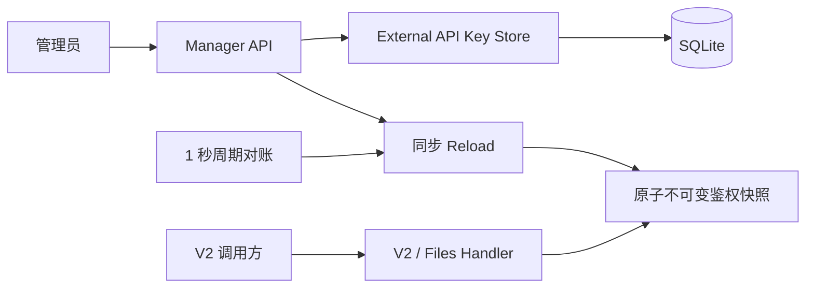
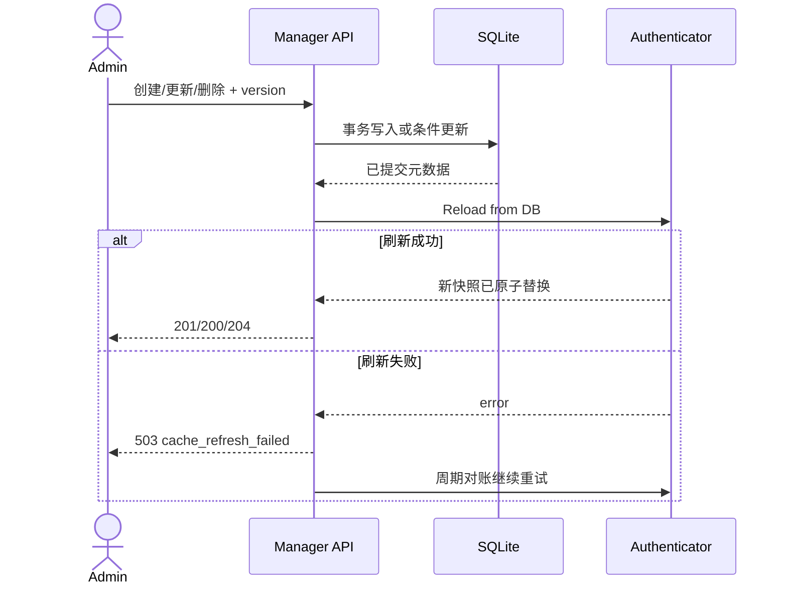
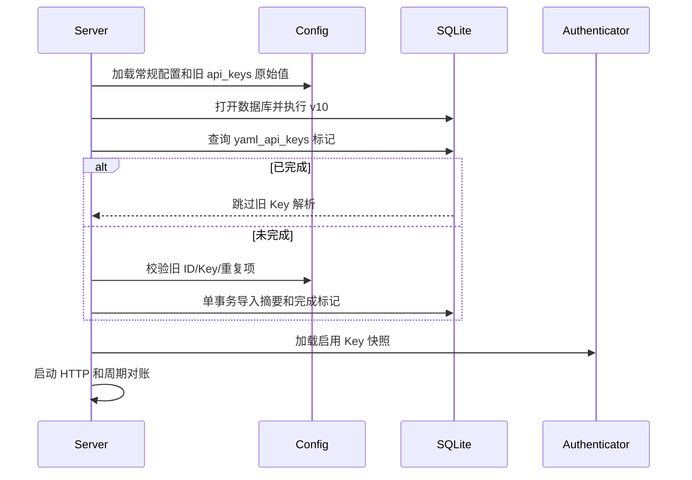

# 对外 API Key 管理技术方案

## 1. 方案概览

| 项目 | 内容 |
| --- | --- |
| 版本/变更 | `005-api-key-management` |
| 设计范围 | Config、SQLite、鉴权缓存、Manager API、V2 Handler、Web UI、部署配置 |
| 部署边界 | 单 Proxy 进程独占单 SQLite |
| 状态 | Approved for development handoff |

目标是将外部 Key 从 YAML 固定列表迁移为 SQLite 真相源，同时保留高频 Bearer 鉴权的内存性能、正常管理操作的即时生效和旧调用方的升级兼容。

## 2. 方案选择

已比较以下方案：

| 方案 | 优点 | 缺点 | 结论 |
| --- | --- | --- | --- |
| 每请求查 SQLite | 一致性直观 | 每次鉴权经过数据库 | 未选 |
| 内存快照 + 写后刷新 | 高频鉴权无 DB I/O，正常写操作即时生效 | 需处理刷新和单进程边界 | 已选 |
| 定时快照 | 实现适中 | 停用不能即时生效 | 未选 |

Key 有 256 位服务端随机熵，因此数据库保存 SHA-256 摘要即可满足不可恢复要求，不使用主密钥加密，也不让主密钥轮换影响客户端 Key。

## 3. 模块划分

| 模块 | 职责 | 主要文件 |
| --- | --- | --- |
| `internal/domain` | Key 实体、输入和稳定领域错误 | `external_api_key.go` |
| `internal/store/sqlite` | CRUD、引用检查、导入事务、鉴权快照读取 | `external_api_key.go`、测试 |
| `internal/authkey` | Key 生成、摘要、不可变内存快照和周期刷新 | `authenticator.go`、测试 |
| `internal/config` | 兼容读取旧 YAML Key，不再要求至少一个 Key | `config.go`、测试 |
| `internal/httpapi/manager` | 管理 API、严格 JSON、状态码和日志 | `api_keys.go`、测试 |
| `internal/httpapi/v2` | 使用共享 Authenticator，不拥有配置切片 | `handler.go`、`files.go`、测试 |
| `cmd/server` | v10 迁移后导入、加载快照、装配和启动刷新器 | `main.go`、测试 |
| Manager Web | 顶栏入口、管理弹窗和一次性展示 | `manager.html/js/styles.css` |

## 4. 核心数据流



数据库是持久化真相源，快照只包含启用 Key 的 `id -> digest` 认证材料，可随时从数据库重建。Manager 成功写库后同步调用 `Reload`；后台每秒对账一次作为瞬时数据库读取失败和内部通知丢失的兜底。

## 5. Key 生成与认证

### 5.1 创建

1. 使用 `crypto/rand` 读取 32 字节并编码为 64 位小写十六进制。
2. 完整 Key 为 `mmx_<hex>`；失败时不降级到伪随机。
3. 内部 ID 单独读取 16 随机字节，格式为 `key_<32 hex>`，与显示名称分离。
4. 计算 `sha256.Sum256([]byte(fullKey))`。
5. 保存摘要、`mmx_` 后前 4 位和末 4 位用于掩码；完整值仅保留在创建调用栈和响应对象中。

### 5.2 快照

`Authenticator` 持有 `atomic.Pointer[snapshot]`。快照创建后不可变，内容为按 32 字节摘要索引的内部 ID 映射。`Authenticate(token)` 在请求局部计算摘要并查找当前快照，不访问 SQLite，不记录 token。

- 启用记录进入快照；停用记录不进入。
- 空快照合法，所有 Bearer token 均认证失败。
- `Load` 构造完整新快照后一次原子替换，读请求只看到旧版或新版，不看到部分更新。
- 启动初次加载失败时拒绝启动。
- 当前不支持多个进程共享数据库；人工直接改库后必须重启。

### 5.3 HTTP 复用

定义最小接口：

```go
type BearerAuthenticator interface {
    Authenticate(token string) (ownerID string, ok bool)
}
```

`internal/httpapi/v2/handler.go` 和 `files.go` 均注入同一实例。Header 解析仍在 HTTP 层完成；Authenticator 只接收不带 `Bearer ` 前缀的 token。下载签名鉴权保持不变。

## 6. 管理写入与一致性



- 正常成功响应意味着当前进程已使用新快照。
- DB 已提交但刷新失败时返回 `503`，UI 必须重新加载列表，不可盲目重复创建；后台对账最终应用数据库状态。
- 更新和删除使用 `version` 乐观锁。刷新失败后的重试可能看到版本冲突，这是“写已持久化、应用待恢复”的明确异常态。
- 周期对账只刷新内存，不修改数据库。

## 7. CRUD 与删除保护

- 名称经 `strings.TrimSpace` 规范化，1 至 128 字符，数据库 `lower(name)` 唯一索引保证大小写不敏感唯一。
- 新建记录默认启用；允许之后停用最后一个启用 Key。
- `PUT` 是全量元数据更新，请求包含 `name`、`enabled` 和 `version`；内部 ID、摘要和指纹不可修改。
- 删除事务先按 `id/version` 定位，再查询 `video_tasks` 和 `idempotency_keys` 的 `api_key_id`。存在任一引用返回 `ErrAPIKeyInUse`，无引用才物理删除。
- 管理列表返回 `masked_key`，由 `key_prefix + "..." + key_suffix` 组成，不返回摘要。

## 8. 启动与 YAML 导入



导入遵循全有或全无：

- 旧 `id` 同时作为导入记录的内部 ID 和初始名称，保持任务归属。
- 旧 ID 不套用新 `key_*` 格式，只要求非空且长度不超过 128。
- 表已有记录而标记缺失时不混合 YAML，写入 0 条完成标记并以数据库为准。
- YAML 无 Key 时写入 0 条标记，允许零 Key 启动。
- 标记存在后不再校验旧 Key，因此清理 YAML 不影响后续启动。

## 9. Manager API 与安全

- 路径、请求响应和错误码见 `API_DELTA.md`。
- 沿用 Manager 会话 Cookie、`Cache-Control: no-store`、同源 Cookie 边界和严格 JSON 解码。
- 请求体限制为 4 KiB；未知字段、重复字段、非 JSON Content-Type 均拒绝。
- 日志只记录 `api_key_id`、动作、版本、稳定错误码，不记录名称以外的秘密材料；创建日志绝不记录响应对象。
- 内部错误统一返回泛化消息，不回显摘要、SQL 或输入 Key。
- 一次性响应仍带 `Cache-Control: no-store`，Web 页面复制后不写 LocalStorage、SessionStorage、URL 或日志。

## 10. UI 实现

- 顶栏增加 `open-api-key-management`，打开独立 `dialog`。
- 对话框采用无嵌套卡片的表格/列表布局，提供创建、重命名、启停和删除。
- 完整 Key 使用独立一次性 `dialog`；关闭时清空 DOM 文本和 JS 状态引用。
- 使用 Web Clipboard API 复制；失败时选中文本供人工复制，不把 Key写入隐藏表单。
- 创建请求被中断时，页面重新加载列表；若记录已创建但完整 Key 响应丢失，必须删除无引用记录或重建，不能提供“再次查看”。

## 11. 配置清理

- `config.example.yaml`、`config.docker.yaml`：移除常规 `api_keys` 段，增加后台创建和升级导入说明。
- `config.yaml`：开发实施时先保留作为本机导入输入；自动测试确认导入后，由人工按 `TEST_ACCEPTANCE.md` 删除该段，避免在未迁移的现有数据库上中断调用。
- `.env.docker.example`：删除 `MINIMAX_API_KEY_CUSTOMER_1`。
- `.env.docker`：删除外部 Key 变量以及未被任何配置引用的 `MINIMAX_UPSTREAM_URL`、`MINIMAX_PUBLIC_UPSTREAM_URL`、`MINIMAX_UPSTREAM_JOBS_URL`。
- 保留 `MINIMAX_ADMIN_PASSWORD`、`MINIMAX_PROXY_MASTER_KEY`、`generation_profiles` 和旧 YAML `upstreams` 导入解析能力。

## 12. 风险与处理

| 风险 | 影响 | 处理 |
| --- | --- | --- |
| 完整 Key 响应在网络中断时丢失 | 管理员无法恢复值 | 列表可见记录但不显示 Key；删除无引用记录后重建 |
| 写库后 Reload 失败 | 持久状态与当前快照短暂不一致 | 返回 503、页面重载、1 秒周期对账 |
| 多进程共享 SQLite | 一个进程的停用不能通知其他进程 | 明确不支持，部署保持单进程 |
| 旧 YAML 重复名称或 Key | 无法确定唯一身份 | 全量回滚并拒绝启动，修正后重试 |
| Key 有历史引用 | 物理删除破坏可追溯性 | 事务拒绝删除，只允许停用 |

## 13. 回滚

- 数据库 v10 是前向新增，回滚应用不删除新表。
- 回滚前停止新二进制，恢复备份的 YAML `api_keys` 和对应环境变量，再启动旧二进制。
- 新版本后台创建但未写入旧 YAML 的 Key 在旧二进制中不可用，这是回滚前必须人工评估的兼容影响。
- 不支持新旧二进制并行共享数据库。
