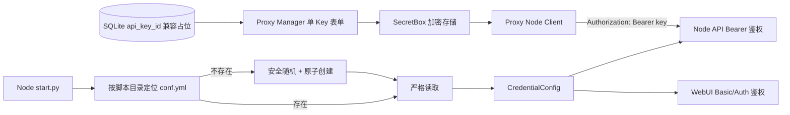

# Node 单 Key 与 conf.yml 技术实现方案

| 项目 | 内容 |
| --- | --- |
| 项目名称 | MiniMax-H3 Node / MiniMax-H3-Proxy |
| 版本/变更 | `006-node-single-key-conf` |
| 设计范围 | Node 配置与鉴权、Proxy 节点管理/存储/调用链 |
| 生成日期 | 2026-08-13 |
| 状态 | Draft |

## 1. 背景与目标

本方案把 Node API 和 WebUI 凭据统一到根目录 `conf.yml`，并让 Proxy 只管理一个 Node API Key。关键约束是凭据不能被环境变量旁路、已有文件不能被自动覆盖、首次并发启动不能产生不同凭据、历史 Proxy 数据库不做结构迁移。

不包含 Proxy 外部客户 Key 管理、Node 多 Key/轮换/scope、WebUI 在线改密和数据库删列。

## 2. 核心概念与数据字典

| 名词 | 代码名 | 说明 | 适用范围 | 备注 |
| --- | --- | --- | --- | --- |
| 凭据配置 | `CredentialConfig` | 从 `conf.yml` 严格解析的 API 与 WebUI 凭据 | Node | 不进入环境变量 Settings |
| Node API Key | `api.key` | 32 位字母数字共享密钥 | Node/Proxy | 所有 Node 路由同权 |
| WebUI 用户 | `webui.username` | 固定 `admin` | Node | 不允许其他值 |
| WebUI 密码 | `webui.password` | 8 位字母数字，至少一字母一数字 | Node | 明文仅存在本地配置 |
| 兼容占位列 | `api_key_id` | 历史数据库非空约束所需 | Proxy SQLite | 应用层忽略语义 |

## 3. 模块设计

| 模块 | 职责 | 核心能力 | 上游依赖 | 下游依赖 |
| --- | --- | --- | --- | --- |
| Node 配置加载器 | 定位、生成、解析凭据 | 安全随机、原子创建、严格 YAML 校验 | `start.py` 路径 | Node app/UI auth |
| Node API 鉴权 | 校验 Bearer Key | 常量时间比较、统一 401 | `CredentialConfig` | 全部受保护路由 |
| Node WebUI 鉴权 | 校验用户名和密码 | 常量时间比较 | `CredentialConfig` | Gradio/WebUI |
| Proxy Manager | 管理单 Key 节点 | 32 位校验、留空复用、拒绝废弃字段 | Manager session | SecretBox/Store |
| Proxy Store | 保持旧库兼容 | 空字符串占位、历史值忽略 | 领域输入 | SQLite v7 schema |
| Proxy Node Client | 调用 Node | 原样发送 `Bearer <key>` | 解密后的 Key | Node API |

## 4. 架构设计

凭据加载结果必须显式传入 `create_app` 和 WebUI 鉴权构造函数，避免通用 Pydantic Settings 继续接受 `H3_API_KEY` 等环境变量并形成第二来源。

## 5. 核心流程设计

### 5.1 Node 首次启动与重启

1. `start.py` 以自身绝对路径的父目录计算 `conf.yml`，不依赖当前工作目录。
2. 若文件不存在，生成满足规则的三项凭据，序列化为固定 YAML 结构并以独占创建方式落盘。
3. 若另一个进程已先创建文件，当前进程放弃自有随机值并重新读取磁盘文件。
4. 严格解析顶层 `api`、`webui` 及其字段；拒绝缺失、额外字段、错误类型和不合法值。
5. 启动日志只提示文件路径和状态，不输出任何秘密。

异常分支：权限不足、目录不可写、YAML 非法或字段不合法均导致启动失败，原文件保持不变。

### 5.2 Proxy 节点保存与测试

1. Manager JSON 使用严格未知字段拒绝策略，`api_key_id` 直接返回 400。
2. 新建 H3、Legacy 升级和无已存凭据的连接测试必须提供合法 Key。
3. 编辑既有 H3 节点时，空 Key 表示复用完整的密文、Nonce 与指纹；不会先解密再回写。
4. Store 对 H3 `api_key_id` 写空字符串，对历史值只扫描后丢弃。
5. 所有 Node Client 从 SecretBox 获取单 Key并直接形成 Bearer Header。

## 6. 接口设计摘要

详细变化见 `API_DELTA.md`。

| 模块 | 主要能力 | 权限边界 |
| --- | --- | --- |
| Node API | 健康、能力、执行、产物与清理接口 | 单 Key 访问全部受保护路由 |
| Proxy Manager | 节点创建、更新、测试 | 现有 Manager 会话；请求只含单 Key |

## 7. 数据库设计摘要

详细变化见 `DATABASE_DELTA.md`。不新增迁移，`api_key_id` 继续留在 v7 表结构中，仅作为约束兼容占位。

## 8. 缓存、消息与异步任务

无新增缓存、消息队列或定时任务。Node 首次生成的并发一致性由文件系统独占创建保证。

## 9. 安全与权限设计

- 随机数使用语言标准库密码学安全随机源，不使用时间戳或伪随机默认生成器。
- Key 和密码使用允许字符表拒绝采样或等价无偏方法生成。
- API Key 与 WebUI 用户密码比较使用 `secrets.compare_digest` 或等价常量时间比较。
- `conf.yml` 加入 `.gitignore`；`conf.example.yml` 不包含实际秘密。
- Node 和 Proxy 日志均禁止输出 Authorization、Key、密码、配置全文、密文和私有服务地址。
- Proxy 继续使用现有 SecretBox 加密 Node Key，响应永不回显明文。

## 10. 性能与可靠性设计

| 关注点 | 目标 | 设计策略 | 验证方式 |
| --- | --- | --- | --- |
| 启动幂等 | 重启不改变凭据 | 已存在文件只读 | 摘要和 mtime 对比 |
| 并发首次启动 | 仅一个有效配置 | 独占原子创建并重读赢家文件 | 并发单元测试 |
| 鉴权开销 | 不引入可见回归 | 内存中常量时间字符串比较 | 全路由测试 |
| 数据兼容 | v7 无迁移启动 | 保留列和约束，应用层忽略 | 历史库夹具测试 |

## 11. 实施边界

开发按 `task.md` 采用测试驱动顺序，先落失败用例，再实现配置、鉴权、存储和页面。真实 GPU 执行、两项目现场重启、文件权限检查及业务验收只在 `TEST_ACCEPTANCE.md` 中由人工确认。

## 12. 风险、假设与人工确认项

| 类型 | 内容 | 影响 | 处理方式 |
| --- | --- | --- | --- |
| 风险 | Node 与 Proxy 只升级一侧 | 全部 Node 请求 401 | 要求同一发布窗口升级并重新录入 Key |
| 风险 | 明文配置权限过宽 | 本机其他用户可能读取 | 发布验收检查 ACL/权限 |
| 风险 | 严格解析使旧手写文件启动失败 | 服务不可用 | 启动错误必须指出字段，不自动修复 |
| 假设 | 部署目录可写 | 首次启动可创建文件 | 部署前检查目录权限 |
| 人工确认 | 真实模型节点调用和取消 | 依赖 GPU/模型状态 | 人工联调阶段执行 |
