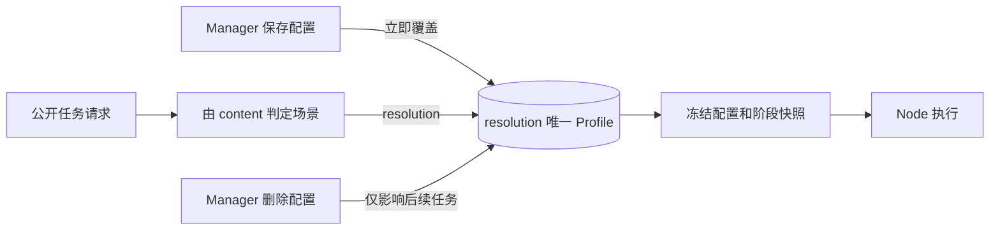

# 模型请求配置简化技术方案

## 1. 架构

Profile 从版本化发布实体改为按请求分辨率唯一的即时配置。公开任务创建时读取当前配置并冻结快照，此后配置修改或删除不影响该任务。



## 2. 领域模型

- `ProfileConfig` 删除 `Model/Scenario/DefaultRatio/AllowedRatios/Watermark`。
- `GenerationProfile` 删除 `MainModel/FPS/CFG`，保留 `ModelMode/Steps/SageAttention/CacheMode`。
- `ModelRequestProfile` 删除业务版本、状态、来源和发布字段；保留 `row_version` 做乐观并发。
- 删除 Profile Test 领域类型、Worker、Store 和发布门禁。

## 3. 服务与存储

服务接口收敛为：

```go
Create(ctx context.Context, resolution string, config domain.ProfileConfig, administrator string) (domain.ModelRequestProfile, error)
Update(ctx context.Context, id string, rowVersion int64, config domain.ProfileConfig, administrator string) (domain.ModelRequestProfile, error)
Delete(ctx context.Context, id string, rowVersion int64) error
Get(ctx context.Context, id string) (domain.ModelRequestProfile, error)
List(ctx context.Context) ([]domain.ModelRequestProfile, error)
GetByResolution(ctx context.Context, resolution string) (domain.ModelRequestProfile, error)
```

- Create 对 resolution 唯一冲突返回 409。
- Update 不允许修改 resolution，成功提交事务后立即对新任务可见。
- Delete 先解除历史任务引用再物理删除，不检查任务状态。
- 当前任务创建路径直接查询 SQLite，无 Profile 缓存失效问题。

## 4. 三场景共用配置

`ValidateCreate` 继续由 content 判定 `t2va/i2va/r2va` 和合法 ratio。`freezeStages` 根据任务场景下发 `scenario`，但尺寸始终从同一个 resolution Profile 的完整 `ratios[request.Ratio]` 获取。

Profile 校验不再使用 scenario-specific allowed ratios，而是要求 `adaptive` 和六个固定比例映射完整存在。公开 API 仍执行场景规则：文生不能 adaptive，图生归一为 adaptive，全能参考支持全部比例。

## 5. 固定和逐请求参数

- generation 固定 `fps=24`。
- `fl2va_model/ref2va_model` 固定 `__follow_model_mode__`。
- 不发送 CFG。
- `aigc_watermark=true` 时追加 watermark stage；false/省略时不追加。
- Node API schema 不变，保留其他可信调用方的通用能力。

## 6. Manager 页面

页面以最多三条配置的简洁列表呈现，不显示状态或版本。编辑表单只呈现有效字段；已有配置的请求分辨率只读。操作区为“保存修改”和带确认的删除按钮，不再显示测试、发布、复制。

## 7. 兼容与风险

| 风险 | 控制 |
| --- | --- |
| 迁移选择错误旧版本 | 明确保留 `updated_at/id` 最新记录；升级前备份 |
| 删除影响运行任务 | 先置空 task.profile_id；阶段快照仍是执行权威 |
| 更新瞬间并发创建任务 | SQLite 事务序列化；任务读取到更新前或更新后的完整配置，不允许半配置 |
| 同一配置缺少某场景比例 | 强制保存完整七种比例映射；公开层保留场景 ratio 校验 |
| 水印默认变化 | true/false/省略均做回归；同步公开 API 文档 |

## 8. 不在范围

- 不简化 Node 内部执行 API。
- 不修改 MiniMax-H3 本地 Gradio 工作台。
- 不为配置保留审计历史或恢复站。
