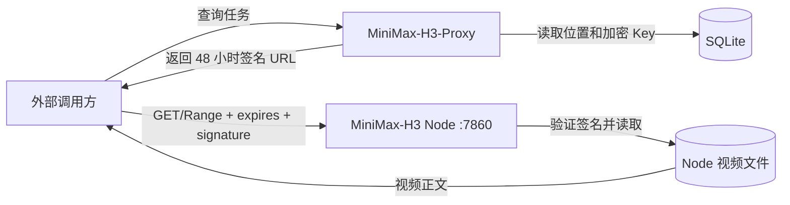

# 技术实现方案

| 项目 | 内容 |
| --- | --- |
| 项目名称 | MiniMax-H3 Node 与 MiniMax-H3-Proxy |
| 版本/变更 | `008-direct-node-artifact-delivery` |
| 设计范围 | Node 文件路由、Proxy URL 签发、配置与兼容路由 |
| 生成日期 | 2026-08-14 |
| 状态 | Draft |

## 1. 背景与目标

- 当前 Proxy 是视频数据面，会解密 Node Key、读取 Node artifact 并向调用方流式复制正文。
- 本次将 Proxy 收敛为任务和授权控制面，Node 成为视频数据面。
- JSON API 结构、任务归属校验和 Manager 播放交互保持不变。
- 不引入新依赖、数据库迁移、对象存储或新的节点配置字段。

## 2. 核心概念与数据字典

| 名词 | 代码名 | 说明 | 适用范围 |
| --- | --- | --- | --- |
| 逻辑产物 | `artifact_id` | Proxy 侧跨节点稳定 ID | Proxy 数据库与任务响应映射 |
| 节点产物 | `node_artifact_id` | Node 本地文件 ID | Node 公共下载路径 |
| 活动位置 | `artifact_location` | 逻辑产物当前可用的 Node 位置 | Proxy URL 签发 |
| 节点根地址 | `service_url` | 数据库已有、Proxy 与外部均可访问的根 URL | Proxy URL 前缀 |
| 下载签名 Key | `download_signing_key` | 从 Node API Key 域隔离派生的 HMAC Key | Go/Python 共享契约 |

## 3. 模块设计

| 模块 | 职责 | 核心能力 | 依赖 |
| --- | --- | --- | --- |
| Node Download Auth | 验证公开链接 | Key 派生、规范串、TTL、常量时间比较 | `CredentialConfig.api_key` |
| Node Artifact Route | 输出视频正文 | 活动性校验、完整文件、单 Range、受控响应头 | 现有 `ArtifactService` |
| Proxy Direct URL Signer | 生成 Node URL | 所有权/位置解析、Node Key 解密、HMAC 签名、URL 组装 | SQLite、Node secrets、时钟 |
| V2/Manager Mapper | 返回视频 URL | 使用带 context 的 signer，保持 DTO 不变 | Direct URL Signer |
| Proxy Legacy File Route | 兼容旧 URL | 原签名验证和正文代理 | 现有 Artifact Service |

## 4. 架构设计

Proxy 不向 Node 发起签发请求。Go 与 Python 使用同一份版本化 HMAC 契约，因此任务查询不依赖 Node 当时在线；真正下载仍要求 Node 可达且 artifact 存在。

## 5. 核心流程设计

### 5.1 Proxy 签发直接下载 URL

1. V2 查询先按现有外部 API Key 完成任务所有权过滤；Manager 查询先完成会话鉴权。
2. Signer 使用请求 context 和逻辑 artifact ID 查询活动位置，取得 `node_id/node_artifact_id`。
3. 读取未删除节点的根 `service_url` 与加密 Key；节点是否参与新任务调度不影响已完成 artifact 的链接签发。
4. 解密 Node API Key，派生下载签名 Key。
5. 设置 `expires = now.UTC().Unix() + 48*60*60`，签署节点 artifact ID。
6. 使用结构化 URL API 将路径设置为 `/public/v1/artifacts/{escaped_id}/content`，添加 `expires/signature`，禁止字符串拼接未校验 URL。
7. 返回绝对 URL；日志只记录 ID 和过期秒数，不记录节点地址、Key 或完整 URL。

异常分支：位置、节点、Key 或 URL 无效时，查询返回现有稳定内部错误；不得退回无签名 Node 内部地址。

### 5.2 Node 验签与文件输出

1. 公共路由严格解析 `expires` 和 `signature`，拒绝重复 query 参数、未知授权头不参与判定。
2. 检查 `now < expires <= now + 48h + 5m`。
3. 从 `CredentialConfig.api_key` 派生专用 Key，按 `API_DELTA.md` 生成期望签名并常量时间比较。
4. 验签成功后调用现有 Artifact Service 获取活动 artifact 和安全文件路径。
5. 复用内部 content 路由的响应构造逻辑，支持完整文件或一个 Range。
6. 签名错误统一返回 `403 invalid_download_signature`；artifact 状态错误返回 `404 artifact_not_found`。

### 5.3 旧链接兼容

- Proxy `/v2/files` handler、旧 artifact owner 签名验证和 Node 流式读取暂不删除。
- 新 Direct URL Signer 与旧 content proxy 职责分离，避免为了签新 URL 继续依赖 `server.public_base_url`。
- 旧链接 TTL 到期后自然退出使用；是否移除兼容路由需后续基于访问日志单独决策。

## 6. 接口设计摘要

| 模块 | 接口数量 | 主要能力 | 权限边界 |
| --- | --- | --- | --- |
| Node public artifact | 1 | 48 小时签名下载和 Range | 完整 URL 是临时 bearer credential |
| Proxy V2 query | 2 | 返回 Node 直链 | 外部 API Key 先校验任务归属 |
| Proxy Manager tasks | 1 | 返回 Node 播放直链 | Manager 会话保护列表 |
| Proxy legacy files | 1 | 兼容已签发旧链接 | 旧签名或 owner Bearer |

## 7. 数据库设计摘要

无 DDL 或数据迁移。复用：

- `video_tasks.result_artifact_id`
- `task_artifacts`
- `artifact_locations.node_id/node_artifact_id/state/is_primary`
- `model_service_nodes.service_url/api_key_ciphertext/api_key_nonce/deleted_at`

## 8. 缓存、消息与异步任务

- 不缓存签名 URL；每次查询按当前时间和当前活动位置重新生成。
- 不增加 MQ、后台任务或 Node 签发 RPC。
- 正文继续使用 `private, no-store`，避免共享缓存扩大持链访问范围。

## 9. 安全与权限设计

- 外部 API Key 和 Manager 会话仍保护任务元数据；Node 公共 URL 不接受这些凭据。
- 下载签名 Key 与 Node Bearer 用途通过带版本域字符串派生隔离。
- HMAC 绑定方法、节点 artifact ID 和 expires，使用 SHA-256、URL-safe Base64 无填充和常量时间比较。
- Node API Key 不进入 URL、响应或日志。Key 轮换同时撤销所有旧下载链接。
- Node 公共路由只能读取单个活动 artifact，不能列目录、查询元数据、导入或删除。
- 反向代理日志必须隐藏或丢弃 `signature` query 参数。

## 10. 性能与可靠性设计

| 关注点 | 目标 | 设计策略 | 验证方式 |
| --- | --- | --- | --- |
| Proxy 带宽 | 新链接视频正文为 0 | 客户端直连 Node | Proxy/Node 网卡流量对照 |
| Proxy 查询延迟 | 不依赖 Node RPC | 本地数据库读取与 HMAC | Go benchmark/接口测试 |
| Node 内存 | 不整文件缓冲 | FileResponse/64 KiB Range 流 | 大文件播放人工验证 |
| 播放兼容 | 支持拖动和续传 | 单 Range、ETag、Accept-Ranges | 浏览器与 curl 验证 |
| 时间可靠性 | 容忍小幅时钟误差 | 5 分钟未来窗口余量、生产 NTP | 双机时钟偏差测试 |

## 11. 任务拆解提示

- Node 先以 TDD 增加共享签名器和公开 content 路由，并抽取内部/公开路由共用的文件响应构造函数。
- Proxy 再以 TDD 将 URL signer 改为带 context 的活动位置签名器，并切换 V2/Manager 调用点。
- 保留旧文件 handler 回归用例，移除配置必填和部署示例变量。
- 两个项目分别运行单元测试、静态检查和构建，再做跨语言固定测试向量验证。
- 开发完成后按 `requesting-code-review` 做独立审查；真实网络流量与 48 小时到期属于人工验收。

## 12. 风险、假设与人工确认项

| 类型 | 内容 | 影响 | 处理方式 |
| --- | --- | --- | --- |
| 假设 | 数据库 `service_url` 同时被 Proxy 和外部访问 | 地址不满足时客户端无法下载 | 部署前逐节点从外部网络验证 |
| 风险 | 完整 URL 被转发 | 48 小时内他人可访问 | 用户已接受；HTTPS、日志脱敏、固定 TTL |
| 风险 | Go/Python 签名实现漂移 | 全部链接返回 403 | 固定测试向量和跨项目契约测试 |
| 风险 | Node Key 轮换 | 旧链接立即失效 | 重新查询任务签发新链接 |
| 人工确认 | 视频流量确实绕过 Proxy | 决定本变更是否达成成本目标 | 发布前后采集 Proxy/Node 流量 |
| 人工确认 | 反向代理仅公开下载路径且隐藏 query | 影响安全边界 | 部署负责人上线前检查 |
