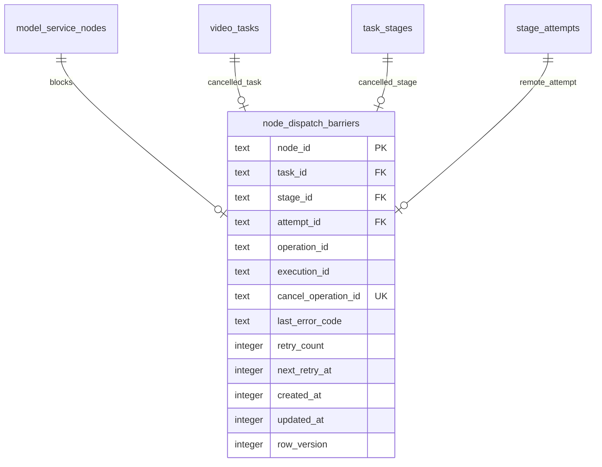

# Node 调度屏障数据库增量设计

## 1. 概述

- 设计范围：为 H3 Node 取消未确认状态增加持久化调度屏障。
- 数据库：SQLite。
- 迁移目标：新增 `migrations/014_node_dispatch_barriers.sql`，`PRAGMA user_version = 14`。
- 历史数据：不回填；升级时没有屏障的历史 `cancelled/cancelling` 任务不推断远端 execution 状态。
- 为保证提交响应丢失时能用原 operation 精确重放，v14 同时为 `stage_attempts` 增加可空的 `request_snapshot_json`。新 attempt 在首次网络提交前保存 materialize 后的完整 Node 请求；历史 attempt 不回填。

## 2. ER 图



## 3. 表结构

### 3.1 `node_dispatch_barriers`

表说明：保存尚未证明远端 execution 已停止的 Node 级调度屏障。表中存在某 `node_id` 时，该 Node 不得领取新 stage。

| 字段 | SQLite 类型 | 必填 | 默认值 | 索引 | 说明 |
| --- | --- | --- | --- | --- | --- |
| `node_id` | TEXT | 是 | - | PK | 关联 `model_service_nodes.id`，同时保证每 Node 最多一个屏障 |
| `task_id` | TEXT | 是 | - | INDEX | 发起中止的本地任务 |
| `stage_id` | TEXT | 是 | - | - | 对应活动 stage |
| `attempt_id` | TEXT | 是 | - | - | 对应已创建的非终态 attempt |
| `operation_id` | TEXT | 是 | - | - | 原执行 operation，用于恢复未绑定 execution |
| `execution_id` | TEXT | 否 | NULL | - | 已知 Node execution；允许提交响应竞争时为空 |
| `cancel_operation_id` | TEXT | 是 | - | UNIQUE | 固定 `stage-cancel-<attempt_id>`，用于幂等取消 |
| `last_error_code` | TEXT | 否 | NULL | - | 最近一次脱敏错误码 |
| `retry_count` | INTEGER | 是 | `0` | - | 对账失败次数，仅用于观测和退避 |
| `next_retry_at` | INTEGER | 是 | `0` | INDEX | 下次允许对账的 UTC Unix 毫秒 |
| `created_at` | INTEGER | 是 | - | - | UTC Unix 毫秒 |
| `updated_at` | INTEGER | 是 | - | - | UTC Unix 毫秒 |
| `row_version` | INTEGER | 是 | `1` | - | 条件更新和删除版本 |

约束：

- 主键：`node_id`。
- 唯一约束：`cancel_operation_id`。
- 外键：逻辑关联 Node、任务、stage 和 attempt；沿用项目现有外键策略，不级联删除。
- 检查：`retry_count >= 0`、`next_retry_at >= 0`、`row_version >= 1`、所有 ID 非空。
- 软删除：不适用；屏障是活动工作项，安全解除后物理删除，历史由 attempt 和结构化日志保留。

索引：

| 索引名 | 字段 | 类型 | 目的 |
| --- | --- | --- | --- |
| SQLite 主键索引 | `node_id` | 唯一 | Runtime 按 Node 常数时间读取 |
| `uq_node_dispatch_barriers_cancel_operation` | `cancel_operation_id` | 唯一 | 防止重复取消身份 |
| `idx_node_dispatch_barriers_retry` | `next_retry_at,node_id` | 普通 | 查找到期屏障 |
| `idx_node_dispatch_barriers_task` | `task_id` | 普通 | 管理中止和诊断关联 |

## 4. 状态和事务语义

屏障表不设置冗余 status；“行存在”即 active，“行删除”即 resolved。

### 4.1 建立屏障事务

同一 `BEGIN IMMEDIATE` 内：

1. 条件读取可中止 task、活动 stage 和最新非终态 attempt。
2. attempt 存在时插入屏障；`node_id` 冲突返回状态冲突，禁止覆盖其他未收口 execution。
3. attempt 写为 `failed`，`error_code='task_cancelled'`。
4. 未结束 stages 写为 `cancelled` 并清理 lease。
5. task 写为 `cancelled`，清理 `upstream_id/active_stage_id`，生成 callback delivery。

### 4.2 对账更新

- 找回 execution：按 `node_id + row_version` 更新 `execution_id`。
- 暂时失败：增加 `retry_count`，写 `last_error_code/next_retry_at`。
- 安全终态：按 `node_id + row_version` 删除屏障。
- 所有网络调用在事务外执行，更新失败时重新读取屏障，不猜测最新状态。

## 5. 迁移与兼容

迁移 SQL 结构：

```sql
CREATE TABLE node_dispatch_barriers (
    node_id TEXT PRIMARY KEY REFERENCES model_service_nodes(id),
    task_id TEXT NOT NULL REFERENCES video_tasks(task_id),
    stage_id TEXT NOT NULL REFERENCES task_stages(id),
    attempt_id TEXT NOT NULL REFERENCES stage_attempts(id),
    operation_id TEXT NOT NULL CHECK (length(operation_id) > 0),
    execution_id TEXT,
    cancel_operation_id TEXT NOT NULL UNIQUE CHECK (length(cancel_operation_id) > 0),
    last_error_code TEXT,
    retry_count INTEGER NOT NULL DEFAULT 0 CHECK (retry_count >= 0),
    next_retry_at INTEGER NOT NULL DEFAULT 0 CHECK (next_retry_at >= 0),
    created_at INTEGER NOT NULL,
    updated_at INTEGER NOT NULL,
    row_version INTEGER NOT NULL DEFAULT 1 CHECK (row_version >= 1)
);

ALTER TABLE stage_attempts ADD COLUMN request_snapshot_json TEXT
    CHECK (request_snapshot_json IS NULL OR json_valid(request_snapshot_json));

CREATE INDEX idx_node_dispatch_barriers_retry
    ON node_dispatch_barriers(next_retry_at,node_id);
CREATE INDEX idx_node_dispatch_barriers_task
    ON node_dispatch_barriers(task_id);

PRAGMA user_version = 14;
```

- 历史数据兼容：表为空启动，不改变既有任务查询。
- 新版本创建的 attempt 必须写入 `request_snapshot_json`；历史未绑定 execution 且无快照的 attempt 保留屏障并报告 `execution_request_snapshot_missing`，不得猜测请求或解除屏障。
- Node 更新/删除：`activeTaskCount` 必须把屏障计入活动占用。
- 回滚：升级前备份 SQLite；回退旧二进制时恢复备份，不提供自动 down migration。

### 5.1 H3 Node execution 提交状态

H3 Node 自身 SQLite 的 `node_executions` 增加可空字段 `submission_state`，取值为 `submitting/submitted/uncertain`：

- `submitting`：稳定 prompt ID 已持久化，但提交协程尚未返回；GET 不得以 Comfy 队列/历史暂时不存在为终止证据。
- `submitted`：Comfy 已确认返回相同 prompt ID，允许常规对账。
- `uncertain`：提交响应丢失或 Node 重启中断了提交协程，允许使用已持久化 prompt ID 对账。
- 新库由 `001_init.sql` 创建字段；旧库由 `Database.migrate()` 检查 `PRAGMA table_info` 后执行幂等 `ALTER TABLE`。启动时遗留的 `submitting` 转为 `uncertain`。

## 6. 与流程的对应关系

| 接口/流程 | 读取表 | 写入表 | 事务 | 说明 |
| --- | --- | --- | --- | --- |
| Manager 中止 | `video_tasks/task_stages/stage_attempts` | 前述表、`node_dispatch_barriers/callback_deliveries` | 是 | 屏障与本地终态原子提交 |
| Node 取消对账 | `node_dispatch_barriers/task_stages/stage_attempts` | `node_dispatch_barriers` | 短事务 | 网络调用在事务外 |
| Stage 领取 | `node_dispatch_barriers/task_stages/video_tasks` | `task_stages` | 是 | 有屏障的 Node 不领取 stage |
| Node 修改/删除 | `model_service_nodes/node_dispatch_barriers/video_tasks` | `model_service_nodes` | 是 | 屏障视为活动占用 |

## 7. 安全与性能

- 表内不保存请求正文、媒体 URL、API Key 或 Node 响应体。
- 高频查询均以 `node_id` 主键完成；屏障数量上限等于 Node 数量。
- 新索引体积可忽略，不改变任务列表分页和 FIFO 索引。
