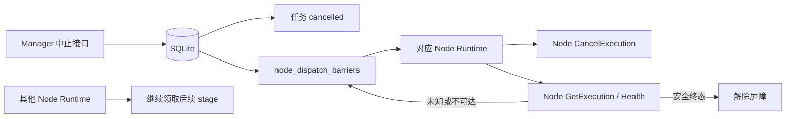
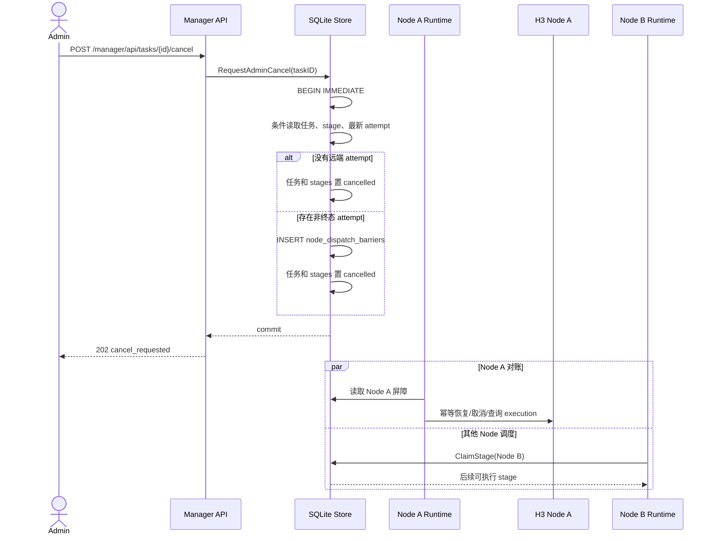
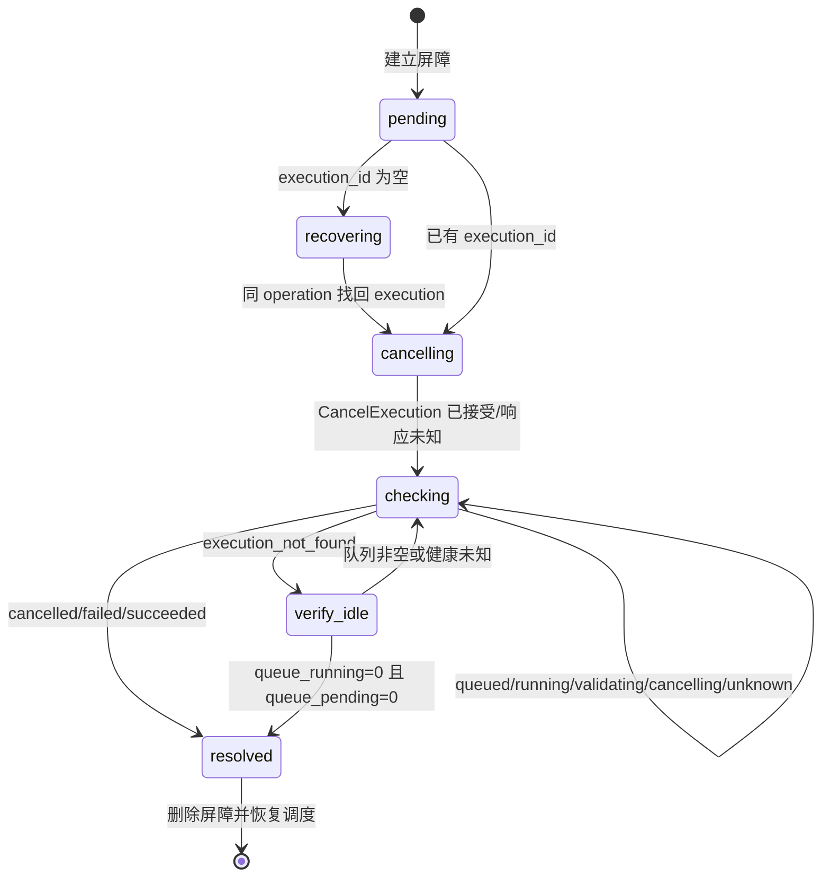

# 运行中任务中止一致性技术方案

| 项目 | 内容 |
| --- | --- |
| 项目名称 | `minimax-h3-tc` |
| 版本/变更 | `009-running-task-cancellation-consistency` |
| 设计范围 | Manager 中止、SQLite 状态事务、Stage Orchestrator、Node Registry、H3 Node API |
| 生成日期 | 2026-08-15 |
| 状态 | In Progress（本地实现完成，待人工联调） |

## 1. 背景与目标

当前实现把“任务对用户结束”和“Node execution 已停止”混为一个状态转换。管理员中止后如果 Node 取消失败、响应丢失或仍在异步中止，本地执行槽已经释放，后续任务会进入仍繁忙的 Node。

本方案将两者拆开：任务立即终态化，Node 通过持久化调度屏障保持隔离并独立对账。屏障是 Node 级资源状态，不是全局队列任务，因此不会阻塞其他 Node。

关键约束：

- 每个 Node 最多一个活动 stage execution。
- Node 的取消接口和创建接口均按 operation 幂等。
- 网络调用不进入 SQLite 事务。
- 不以超时强制解除屏障；只有远端终态或“execution 不存在且 Node 队列为空”可以解除。

## 2. 核心概念

| 名词 | 代码名 | 说明 |
| --- | --- | --- |
| 调度屏障 | `NodeDispatchBarrier` | 持久化记录某 Node 仍需完成取消对账，存在时禁止领取 stage |
| 取消对账 | `ReconcileNodeCancellation` | 使用原 operation/execution 发起幂等取消并查询到安全终态 |
| 本地终态 | `cancelled` | 用户侧任务已结束，不再参与 FIFO 或恢复提交 |
| 安全解除 | `ResolveNodeDispatchBarrier` | 已证明旧 execution 不再占用 Node 后删除屏障 |

## 3. 模块设计

| 模块 | 职责 | 主要改动 |
| --- | --- | --- |
| `httpapi/manager` | 接收管理员中止 | 路径和响应不变，继续唤醒 Registry |
| `store/sqlite` | 原子竞争、建立屏障、终结任务 | 新增屏障表和事务方法；强化 attempt 创建前置条件 |
| `orchestrator` | 优先处理屏障并远端对账 | `ProcessOne` 先查询屏障，再领取 stage |
| `upstream/nodeapi` | 调用既有创建、取消、查询、健康接口 | 不新增路由；保留结构化错误分类 |
| `upstream/registry` | Node 级调度与监控 | 屏障视为该 Node 的活动工作；其他 Node 独立循环 |
| `monitor` | 展示真实 Node 可调度状态 | 屏障期间复用异常状态和稳定错误码 |
| `Minimax-H3/h3_service` | 保证取消 operation 可重放并最终收口 | `cancelling` 重放中断；迟到结果转 `cancelled` |

## 4. 架构设计

每个 Node Runtime 拥有独立 scheduler 循环。Node A 的屏障只让 A 的 Processor 转入取消对账；Node B/C 仍从共享 SQLite 选择各自可执行的最早 stage。

## 5. 核心流程

### 5.1 管理员中止与事务竞争

事务规则：

1. `RequestAdminCancel` 与 `CompleteStage/FailStage/BindStageExecution` 均使用预期状态条件更新。
2. `CreateStageAttempt` 必须同时验证 task 非终态、stage 仍持有当前 lease；取消事务先获胜时禁止创建 attempt。
3. attempt 已创建但 execution 未绑定时，屏障保存 operation ID。即使原提交请求已到达 Node，也可用同一 operation 恢复 execution ID。
4. task、stage、attempt 收口、屏障插入和 callback delivery 在一个 `BEGIN IMMEDIATE` 中完成。

### 5.2 Node 取消对账

处理规则：

- `execution_id` 为空：读取 attempt 在首次提交前持久化的 `request_snapshot_json`，使用 attempt 原 `operation_id` 原样调用 `CreateExecution`；只更新屏障，不复活已取消 stage。历史 attempt 缺少快照时保留屏障并报告稳定错误码，不猜测请求。
- 取消 operation 固定为 `stage-cancel-<attempt_id>`，所有重试复用同一值。
- `CancelExecution` 返回 `cancelling/cancelled` 或请求结果未知后，都继续调用 `GetExecution`。
- Node 收到已存在且响应仍为 `cancelling` 的同一取消 operation 时，不只返回缓存；重新检查目标 execution 并安全重试 adapter cancel。目标已终态时更新 operation 缓存并直接返回终态。
- generation adapter 使用目标 `job_id` 调用 ComfyUI 单任务取消接口。pending 作业原子出队后可立即收口；running 作业只触发目标中断，继续保持 `cancelling`，由 history/queue 对账确认执行器退出。
- generation 提交前生成稳定 UUID，并在同一条件更新中持久化 `started_at + comfy_job_id`；远端 `/prompt` 必须使用该 UUID。取消先获胜时不再启动提交；提交或返回窗口崩溃后仍可按持久化 ID 查询/取消。claim 同时要求 `started_at/comfy_job_id IS NULL`，保证并发调用只有一个提交者。
- `cancelling` 期间的对账网络或协议异常不是退出证明，必须保留状态等待重试，不能借异常释放 Proxy 屏障。
- Node execution 的迟到完成路径若发现数据库状态已是 `cancelling`，不得登记产物，必须清理临时输出、释放制品锁并写 `cancelled`。
- `cancelled/failed/succeeded` 均代表旧 execution 已终止，可解除屏障。取消事务先获胜时不接收迟到产物。
- 404 不能单独证明 Node 空闲；需 `Health.runtime.queue_running + queue_pending == 0`。
- 401/403、5xx、连接失败、协议错误或队列状态缺失均保留屏障，写稳定错误码并按 Node 轮询间隔重试。

### 5.3 调度与重启恢复

1. Node API scheduler 的 `Active` 回调把“存在屏障”视为该 Node 有活动维护工作，从而跳过普通健康门禁并调用 Processor。
2. `Processor.ProcessOne` 先执行 `GetNodeDispatchBarrier(nodeID)`；存在时只运行取消对账，不调用 `ClaimStage`。
3. 没有屏障时沿用现有 stage FIFO。
4. Proxy 启动无需扫描并改写任务；Registry 启动每个 Node Runtime 后自然读取其屏障并恢复。
5. 节点修改和删除的活动检查同时包含未解除屏障，防止对账过程中变更连接或密钥。

## 6. 接口设计摘要

详细行为见 `API_DELTA.md`。

| 模块 | 接口 | 变化 |
| --- | --- | --- |
| Manager | `POST /manager/api/tasks/{task_id}/cancel` | 字段不变；202 表示本地取消事务已提交，不表示 Node 已完成停止 |
| H3 Node | `POST /internal/v1/executions/{id}/cancel` | 路径不变；Proxy 必须复用幂等键并查询到终态 |
| H3 Node | `GET /internal/v1/executions/{id}` | 路径不变；作为屏障解除的首要证据 |
| H3 Node | `GET /internal/v1/health` | 路径不变；仅在 execution 404 时用于确认队列为空 |

## 7. 数据库设计摘要

详细设计见 `DATABASE_DELTA.md`。

| 表 | 说明 | 核心字段 | 关键约束 |
| --- | --- | --- | --- |
| `node_dispatch_barriers` | 每个 Node 最多一个待收口 execution | `node_id/task_id/stage_id/attempt_id/operation_id/execution_id` | `node_id` 主键，取消 operation 唯一 |
| `stage_attempts` 增量 | 保存首次远端提交的精确请求 | `request_snapshot_json` | 可空 JSON；新 attempt 必填，历史数据兼容 |

不修改 `video_tasks` 的外部状态枚举，也不扩展 `stage_attempts.status`；attempt 使用现有 `failed + task_cancelled` 记录本地结束，远端未决状态由屏障表单独拥有。

## 8. 异步任务与一致性

不新增全局后台服务。取消对账复用每 Node 已有 Runtime 和 scheduler：

- 生产者：`RequestAdminCancel` 事务插入屏障并调用现有 `Wake`。
- 消费者：对应 Node 的 `orchestrator.Processor`。
- 幂等：Node 创建使用原 operation，取消使用固定 cancel operation，屏障删除使用 `node_id + row_version` 条件。
- 失败：保留屏障和脱敏 `last_error_code`，不释放 Node，不影响其他 Runtime。

## 9. 安全与权限

- Manager 继续使用既有管理员会话，不扩大普通 API Key 权限。
- Node 请求继续使用数据库加密保存的单 API Key，日志不得输出 Key、完整媒体 URL、请求体或 Node 私有响应。
- 日志记录 `task_id/stage_id/attempt_id/execution_id/node_id/stage/error_code`，不记录 prompt。
- 屏障表不新增敏感业务正文，仅保存稳定资源 ID 和错误码。

## 10. 性能与可靠性

| 关注点 | 目标 | 设计策略 | 验证方式 |
| --- | --- | --- | --- |
| 多 Node 调度 | 单 Node 取消异常不阻塞其他 Node | 每 Node 独立屏障和 Runtime | 双 Node Store/Registry 自动化测试 + 真实环境人工确认 |
| 重启恢复 | 不丢失取消上下文 | SQLite 持久化屏障 | 关闭并重开 Store/Runtime 测试 |
| 防重复生成 | 不创建新 attempt/operation | 原 operation 幂等恢复 | 提交响应丢失竞态测试 |
| SQLite 写锁 | 保持短事务 | 网络请求全部在事务外 | 单元测试与 `go test -race` |

## 11. 风险、假设与人工确认项

| 类型 | 内容 | 影响 | 处理方式 |
| --- | --- | --- | --- |
| 风险 | Node adapter 返回 `cancelling` 后永久不终态 | 对应 Node 长期隔离 | 保留屏障和稳定告警，不超时强制释放 |
| 风险 | 取消与提交跨网络竞争 | 可能存在未绑定 execution | attempt operation 幂等恢复后取消 |
| 风险 | execution 404 但 Comfy 队列仍有旧作业 | 误解除会重现缺陷 | 必须附加健康队列为空条件 |
| 假设 | Node 由 Proxy 独占执行 | 队列为空可作为安全证据 | 部署约束，真实环境人工确认 |
| 人工确认 | 长任务运行中取消确实释放 GPU/Comfy 队列 | 决定 Node 可重新调度 | 真实 Node 故障演练 |
| 人工确认 | 双 Node 下隔离范围正确 | 决定后续任务吞吐 | 多 Node 联调环境确认 |

Node 内部重放与迟到结果收口降低长期隔离概率；如果 Node 进程或底层执行器永久不可达，屏障仍不自动绕过。
