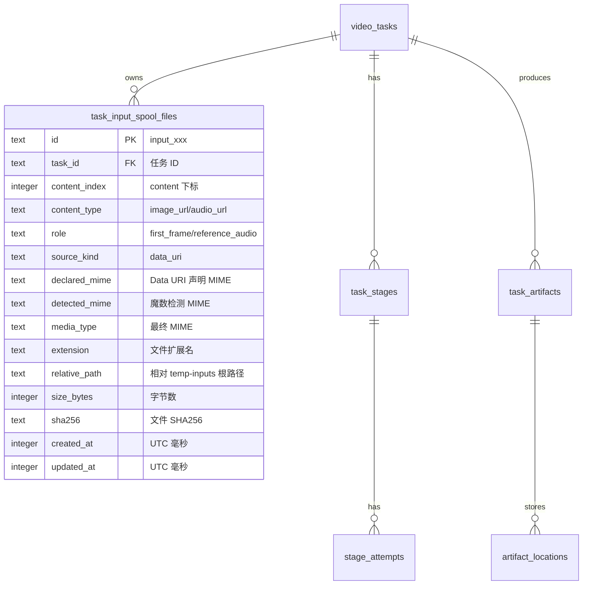

# 输入临时文件与物理删除数据库增量设计

## 1. 概述

- 设计范围：Data URI 输入文件元数据、任务详情读取、后台物理删除和自动迁移。
- 支撑模块：V2 创建任务、Orchestrator 输入导入、Manager 任务详情、Manager 删除、启动孤儿临时目录清理。
- 数据库类型：SQLite。
- 迁移目标：新增 `migrations/015_input_spool_admin_maintenance.sql`，`PRAGMA user_version = 15`。
- 关键约束：数据库不保存 Base64 正文和 BLOB，只保存引用、路径相对值和元数据；后台物理删除必须遵守现有外键引用顺序。

## 2. ER 图



## 3. 表结构设计

### 3.1 `task_input_spool_files`

表说明：保存任务 Data URI 输入对应的本地托管临时文件元数据。文件正文默认位于数据库文件同级的 `temp-inputs`，数据库不保存二进制。

| 字段 | SQLite 类型 | 必填 | 默认值 | 索引 | 说明 |
| --- | --- | --- | --- | --- | --- |
| `id` | TEXT | 是 | - | PK | 稳定输入 ID，建议 `input_` + sha256 前 32 hex |
| `task_id` | TEXT | 是 | - | INDEX | 关联 `video_tasks.task_id` |
| `content_index` | INTEGER | 是 | - | UNIQUE 组合 | 原始 `content` 数组下标 |
| `content_type` | TEXT | 是 | - | - | `image_url` 或 `audio_url` |
| `role` | TEXT | 是 | - | - | 输入角色 |
| `source_kind` | TEXT | 是 | `'data_uri'` | - | 当前仅保存 `data_uri` |
| `declared_mime` | TEXT | 否 | NULL | - | Data URI header 中声明的 MIME |
| `detected_mime` | TEXT | 否 | NULL | - | 文件魔数检测 MIME |
| `media_type` | TEXT | 是 | - | - | 最终采用的 MIME |
| `extension` | TEXT | 是 | - | - | `.jpg/.png/.webp/.wav/.mp3` 等 |
| `relative_path` | TEXT | 是 | - | UNIQUE | 相对数据库同级 `temp-inputs` 的路径，不含盘符 |
| `size_bytes` | INTEGER | 是 | - | - | 文件字节数，必须大于 0 |
| `sha256` | TEXT | 是 | - | - | 小写 hex SHA256 |
| `created_at` | INTEGER | 是 | - | - | UTC Unix 毫秒 |
| `updated_at` | INTEGER | 是 | - | - | UTC Unix 毫秒 |

约束：

- 主键：`id`。
- 唯一约束：`task_id, content_index`，`relative_path`。
- 逻辑外键：`task_id` 关联 `video_tasks.task_id`。是否声明 SQLite 外键按现有表策略执行；物理删除任务时显式删除子表。
- 检查约束：
  - `content_index >= 0`
  - `content_type IN ('image_url','audio_url')`
  - `source_kind = 'data_uri'`
  - `length(relative_path) > 0`
  - `size_bytes > 0`
  - `length(sha256) = 64`
- 软删除：不适用。任务物理删除时删除本表行，孤儿目录由文件清理器处理。

索引设计：

| 索引名 | 字段 | 类型 | 目的 |
| --- | --- | --- | --- |
| `idx_task_input_spool_files_task` | `task_id` | 普通 | 任务详情、执行和删除按任务读取 |
| `uq_task_input_spool_files_task_index` | `task_id,content_index` | 唯一 | 保证 content 下标唯一 |
| `uq_task_input_spool_files_path` | `relative_path` | 唯一 | 防止两个输入指向同一文件 |

## 4. 表关系说明

| 关系 | 说明 | 约束策略 |
| --- | --- | --- |
| `video_tasks -> task_input_spool_files` | 一个任务可有多个本地输入临时文件 | 显式事务删除，不依赖级联 |
| `task_input_spool_files -> temp-inputs` | 每行对应一个本地文件 | DB 记录相对路径，文件系统保存正文 |
| `video_tasks -> task_artifacts/artifact_locations` | 任务产物和 Node 位置 | 物理删除前先用这些记录删除远端产物 |

## 5. 数据迁移与初始化

是否需要 DDL：是，新增 v15 SQL。

建议 SQL：

```sql
CREATE TABLE task_input_spool_files (
    id TEXT PRIMARY KEY CHECK (length(id) > 0),
    task_id TEXT NOT NULL REFERENCES video_tasks(task_id),
    content_index INTEGER NOT NULL CHECK (content_index >= 0),
    content_type TEXT NOT NULL CHECK (content_type IN ('image_url','audio_url')),
    role TEXT NOT NULL CHECK (length(role) > 0),
    source_kind TEXT NOT NULL DEFAULT 'data_uri' CHECK (source_kind = 'data_uri'),
    declared_mime TEXT,
    detected_mime TEXT,
    media_type TEXT NOT NULL CHECK (length(media_type) > 0),
    extension TEXT NOT NULL CHECK (length(extension) > 0),
    relative_path TEXT NOT NULL CHECK (length(relative_path) > 0),
    size_bytes INTEGER NOT NULL CHECK (size_bytes > 0),
    sha256 TEXT NOT NULL CHECK (length(sha256) = 64),
    created_at INTEGER NOT NULL,
    updated_at INTEGER NOT NULL,
    UNIQUE(task_id, content_index),
    UNIQUE(relative_path)
);

CREATE INDEX idx_task_input_spool_files_task
    ON task_input_spool_files(task_id);

PRAGMA user_version = 15;
```

是否需要数据回填：否。历史任务仍使用原 `request_json`，不自动拆出 Base64。

是否需要默认数据：否。

是否需要兼容旧数据：是。执行和查看任务时必须支持：

- 新任务：`proxy-input://<task_id>/<input_id>` + `task_input_spool_files`。
- 旧任务：`data:*;base64,...` 仍在 `request_json` 中，展示时隐藏 Base64 正文，执行时走 legacy decode。

回滚策略：

- 发布前备份 SQLite 和数据库同级 `temp-inputs`。
- 已升级到 v15 后回滚旧二进制，需要恢复升级前备份；不提供自动 down migration。

## 5.1 物理删除外键顺序

现有 SQLite 开启 `foreign_keys(1)`，并且下列表存在非级联引用：

- `video_tasks.active_stage_id -> task_stages.id`
- `video_tasks.result_artifact_id -> task_artifacts.id`
- `task_stages.input_artifact_id/output_artifact_id -> task_artifacts.id`
- `stage_attempts.input_artifact_id/output_artifact_id -> task_artifacts.id`
- `node_dispatch_barriers.attempt_id -> stage_attempts.id`
- `profile_test_runs.artifact_id -> task_artifacts.id`

因此物理删除任务不能简单按“删除子表再删除主表”执行，必须使用以下规则：

1. 若存在 `node_dispatch_barriers WHERE task_id=?`，返回冲突，不删除。
2. 若存在 `profile_test_runs` 引用该任务的 artifact，返回冲突，不删除。
3. 在最终 `BEGIN IMMEDIATE` 中先清空 `video_tasks.active_stage_id/result_artifact_id`。
4. 清空 `task_stages.input_artifact_id/output_artifact_id`。
5. 删除 `stage_attempts`。
6. 删除 `artifact_deletion_items` 后，删除已无 item 的 `artifact_deletion_jobs`。
7. 删除 `artifact_locations`、`task_artifacts`、`task_stages`、`task_input_spool_files`、`callback_deliveries`、`idempotency_keys`。
8. 最后删除 `video_tasks`。

最终事务还要重新校验任务状态、任务版本和屏障状态，避免远端删除期间任务被并发修改。

## 6. 安全与合规

- 敏感字段：`relative_path` 可能泄露内部目录结构，接口只返回文件名或相对标识，不返回绝对路径。
- 加密策略：不加密输入临时文件，保持与当前本地 SQLite 部署一致；生产机器需保护数据目录权限。
- 脱敏策略：Manager 详情不返回 Base64 正文，不在日志记录 prompt、URL、sha256 全量以外的内容按需控制。
- 审计字段：使用 `created_at/updated_at`；后台删除日志记录 `task_id` 和数量，不记录请求正文。
- 数据保留或清理策略：任务存在期间保留本表和对应文件；管理员物理删除任务时删除本表和对应文件；启动孤儿清理只处理无 DB 关联的候选目录、`.part` 文件或孤儿目录。

## 7. 与接口读写逻辑的对应关系

| 接口/流程 | 读取表 | 写入表 | 事务 | 说明 |
| --- | --- | --- | --- | --- |
| 创建任务 | `idempotency_keys/video_tasks` | `video_tasks/task_stages/task_input_spool_files/idempotency_keys` | 是 | DB 失败后清理新建文件 |
| 执行输入导入 | `video_tasks/task_input_spool_files/artifact_locations` | `task_artifacts/artifact_locations` | 部分 | 文件读取和 Node 导入在事务外 |
| Manager 查看详情 | `video_tasks/task_input_spool_files/task_stages` | 无 | 否 | 只读脱敏 |
| Manager 物理删除 | `video_tasks/node_dispatch_barriers/task_input_spool_files/task_artifacts/artifact_locations` | 删除相关表行 | 是 | 远端删除成功且无屏障后提交 |
| 自动迁移 | `schema_migrations` | `schema_migrations/task_input_spool_files` | 是 | 启动时自动执行 |

## 8. 性能与索引检查

- 高频查询：按 `task_id` 读取输入元数据，索引覆盖。
- 排序字段：任务列表仍使用 `video_tasks.created_at/queue_seq`，不变。
- 分页策略：任务详情不分页；任务列表不 join 输入表。
- 可能的慢查询：物理删除时涉及多表删除，按单任务 ID 过滤，数据量小。
- 索引风险：新增表每个任务最多约 12 条输入记录，索引体积可忽略。

## 9. 待确认项

| 问题 | 影响 | 建议确认方式 |
| --- | --- | --- |
| 是否需要在 Manager 里预览图片文件本身 | 若需要预览，要新增仅管理员可访问的临时文件读取接口 | 页面联调时人工确认 |
| 生产数据目录是否有加密磁盘或备份策略 | 输入临时文件不在 SQLite 内，备份策略需要覆盖数据库同级 `temp-inputs` | 部署前人工确认 |
