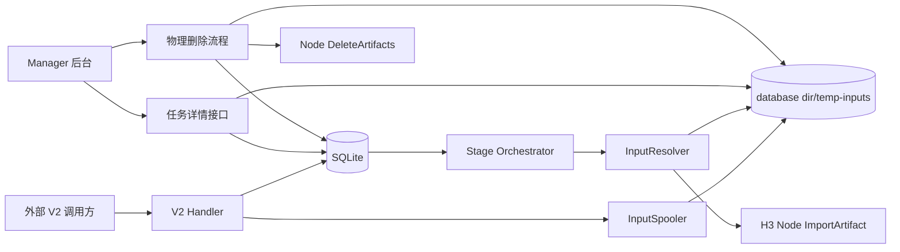
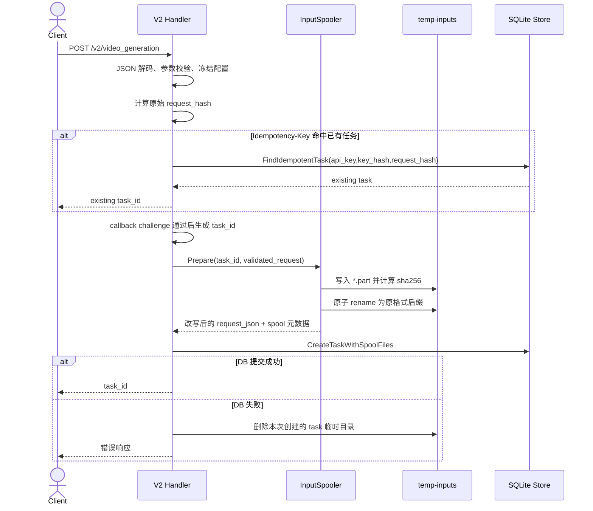
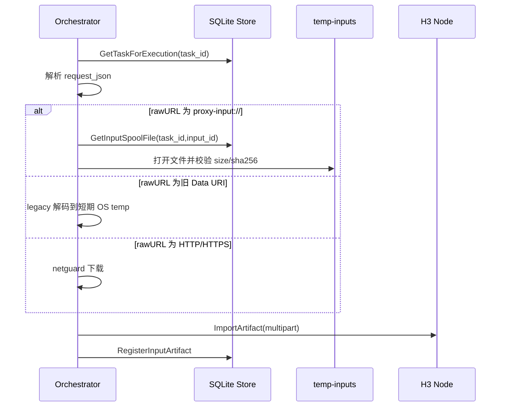
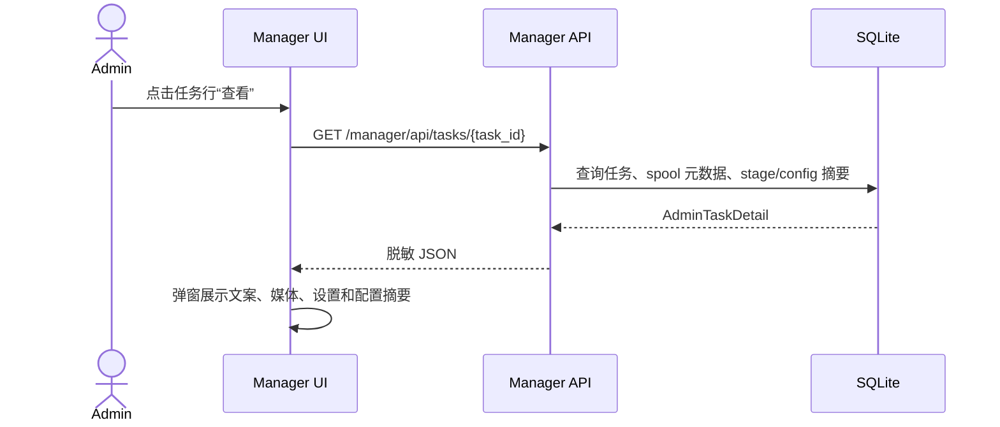
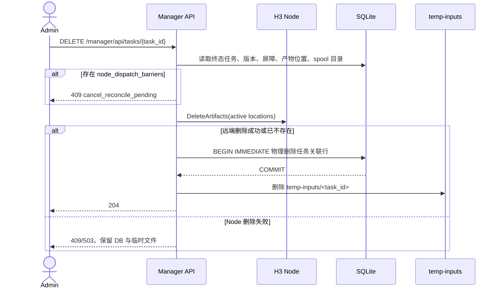

# 输入临时文件、任务详情查看与自动迁移技术方案

| 项目 | 内容 |
| --- | --- |
| 项目名称 | `minimax-h3-tc` |
| 版本/变更 | `010-input-spool-admin-maintenance` |
| 设计范围 | V2 创建任务、输入素材托管、Stage 执行、Manager 任务详情、Manager 删除、SQLite 自动迁移 |
| 生成日期 | 2026-08-15 |
| 状态 | Draft |

## 1. 背景与目标

本次设计解决三个连在一起的问题：Base64 输入导致 SQLite 变大，后台缺少任务请求详情查看，任务删除仍是逻辑删除且不清理新引入的本地输入临时文件。

目标是把二进制输入从数据库中移出，但不牺牲排队任务的重启恢复能力。Proxy 继续负责保存任务快照，只是把 Data URI 正文提前转换为托管临时文件引用。

### 1.1 最终方案确认

本变更采用“数据库小引用 + 本地托管临时文件 + 安全物理删除 + 启动自动迁移”的方案：

1. 新任务的图片和音频 Data URI 在创建阶段解码为本地文件，数据库只保存 `proxy-input://` 引用和元数据。
2. 临时文件保存原始字节，不转码、不重压缩；扩展名根据文件魔数和合法 MIME 确定。
3. 临时文件根目录默认由 `database.path` 推导为数据库文件同级 `temp-inputs`，本次不新增必填配置。
4. 排队任务重启恢复依赖 `request_json` 中的小引用和 `task_input_spool_files` 元数据；任务存在期间输入文件必须保留。
5. Manager 删除只允许终态且无 `node_dispatch_barriers` 的任务；远端 Node 产物删除成功或确认不存在后，再物理删除 DB 行和本地目录。
6. 启动清理只处理 `.part`、候选目录和无 DB 关联的孤儿目录，不按保留期自动删除合法任务。
7. SQLite 通过 v15 migration 在服务启动时自动升级，正式环境不再需要复制本地升级后的数据库文件。

关键约束：

- 排队任务在 Proxy 重启后必须继续执行。
- 数据库不得再保存新任务的 Base64 正文。
- 临时文件保持原始字节，不转码、不重压缩。
- 临时文件根目录默认从 `database.path` 推导：`filepath.Join(filepath.Dir(database.path), "temp-inputs")`，不新增必填配置。
- Manager 查看任务时不能泄露 API Key、callback 密文、Node Key 或完整 Base64。
- 后台删除终态任务必须物理删除本地临时文件和数据库记录。
- SQLite 结构升级由服务启动自动完成，正式环境升级前仍建议备份原数据库和数据库同级 `temp-inputs`。

## 2. 核心概念与数据字典

| 名词 | 代码名 | 说明 | 适用范围 | 备注 |
| --- | --- | --- | --- | --- |
| 输入临时文件 | `InputSpoolFile` | 从 Data URI 解码后由 Proxy 管理的本地文件 | 创建、执行、查看、删除 | 默认位于数据库同级 `temp-inputs` |
| 输入引用 | `proxy-input://` | 写入请求快照的小型引用，指向输入临时文件记录 | `request_json`、执行阶段 | 不包含文件路径 |
| 输入托管服务 | `InputSpooler` | 创建任务阶段解析 Data URI、写文件、改写请求 | `httpapi/v2` | 根目录默认是数据库同级 `temp-inputs`，事务失败时负责清理新文件 |
| 输入解析器 | `InputResolver` | 执行阶段解析 HTTP URL、Data URI legacy 和 `proxy-input://` | `orchestrator` | 兼容旧任务 |
| 任务详情 | `AdminTaskDetail` | Manager 展示用户请求内容的脱敏详情 | `httpapi/manager` | 不返回 Base64 正文 |
| 物理删除 | `PurgeTask` | 删除远端产物、本地临时文件和 SQLite 任务记录 | Manager 删除 | 仅终态且无 Node 屏障任务 |

## 3. 模块设计

| 模块 | 职责 | 核心能力 | 上游依赖 | 下游依赖 |
| --- | --- | --- | --- | --- |
| `internal/httpapi/v2` | 接收和校验外部任务请求 | 在生成任务 ID 后调用 `InputSpooler`，持久化脱 Base64 请求 | 外部调用方 | `store/sqlite`、`inputspool` |
| `internal/inputspool` | 管理 Data URI 临时文件 | 严格解码、格式探测、原子写入、路径校验、清理任务目录 | V2 handler、Manager、Orchestrator | 本地磁盘、SQLite 元数据 |
| `internal/store/sqlite` | 持久化任务和输入元数据 | v15 迁移、创建任务附带 spool 元数据、任务详情读取、物理删除事务 | 服务启动、业务模块 | SQLite |
| `internal/orchestrator` | 执行任务输入素材导入 | 支持 `proxy-input://`，保留旧 Data URI fallback | Node Runtime | `nodeapi.ImportArtifact` |
| `internal/httpapi/manager` | 管理后台任务列表和操作 | 新增详情接口、查看弹窗、物理删除提示 | 管理员会话 | Store、Artifact 删除、InputSpooler |
| `internal/taskpurge` | 物理删除编排 | 检查屏障、调用 Node 删除、提交 DB 物理删除、删除本地目录 | Manager 删除 | Store、Node API、NodeSecrets、InputSpooler |
| `internal/cleanup` | 启动孤儿清理 | 只清理无 DB 关联且超过安全窗口的临时目录，不自动删除合法任务 | 服务启动/维护任务 | Store、本地文件 |
| `migrations` | 数据库结构自动升级 | 新增 v15 SQL 并嵌入 | `sqlite.Open` | SQLite |

## 4. 架构设计

架构说明：

1. V2 入参保持兼容，Data URI 仍由调用方放在 `image_url.url` 或 `audio_url.url`。
2. 创建阶段先把 Data URI 拆出到本地持久临时目录，再写入任务和输入元数据。
3. `video_tasks.request_json` 保存的是可恢复的小型请求快照，其中二进制位置变成 `proxy-input://<task_id>/<input_id>`。
4. 执行阶段不需要公开 URL，只从本地文件流式导入 Node。
5. Manager 查看读取同一份请求快照和元数据，删除走同一份物理清理能力。

## 5. 核心流程设计

### 5.1 创建任务与 Data URI 托管

关键规则：

- `request_hash` 仍基于用户原始规范化请求计算，保证幂等语义不因本地文件名变化而改变。
- 有 `Idempotency-Key` 时，在写临时文件前增加只读预查；命中相同请求直接返回已有任务，避免重复把同一份大 Base64 写入磁盘。并发预查未命中时仍以 `CreateTaskWithSpoolFiles` 的唯一约束为准，失败方清理候选目录。
- `persisted_request_json` 基于改写后的请求保存，不包含 Base64 正文。
- `proxy-input://` 只包含 task ID 和 input ID，不包含磁盘路径，防止路径泄漏和目录穿越。
- 文件名由服务端生成，格式为 `<input_id>.<ext>`；扩展名来自魔数优先、MIME 次之。魔数无法识别但声明 MIME 在既有校验允许范围内时，不直接拒绝，使用声明 MIME 和安全扩展继续，避免比当前 `ValidateCreate` 更激进地破坏兼容。
- 保存原始字节，不转码。PNG 仍是 PNG，JPEG 仍是 JPEG，WAV/MP3 仍是原始音频字节。
- HTTP/HTTPS 输入不在本次改为本地缓存，继续执行阶段下载，避免扩大存储占用。

### 5.2 执行阶段输入导入

异常分支：

- 本地临时文件缺失或 sha256 不匹配：stage 失败并返回稳定错误码 `input_spool_missing` 或 `input_spool_integrity_failed`，不重建猜测文件。
- 历史任务仍含 Data URI：继续走 legacy decode，避免升级后旧排队任务无法运行。
- Node 导入失败：保留本地临时文件，stage 可按既有重试策略再次导入。

### 5.3 Manager 查看任务请求

展示规则：

- 文案完整展示，但不写入日志。
- HTTP/HTTPS 媒体只展示 URL 的脱敏或可复制文本，日志仍不记录。
- Data URI 媒体展示 `source_kind=data_uri`、角色、MIME、大小、sha256 前缀、扩展名和文件状态。
- 配置展示逻辑分辨率、比例、时长、模型模式、steps、缓存模式、LoRA 文件名和强度、插帧/修复开关；不展示内部 Node Key。
- 如果是历史任务且 `request_json` 仍含 Data URI，接口返回 `legacy_base64_present=true`，前端提示“历史任务含 Base64，已隐藏正文”。

### 5.4 后台物理删除任务

物理删除编排规则：

1. 远端删除前读取候选位置和任务版本；每个 location 使用稳定 operation ID `purge-<task_id>-<location_id>` 调用 Node `DeleteArtifacts`，使并发或重试删除保持幂等。
2. Node 返回 `deleted` 或 `already_absent` 才能进入 DB 物理删除；`artifact_locked/5xx/认证错误/协议错误` 均保留 DB 和本地文件。
3. DB 最终事务重新校验任务仍为终态、版本未变化、没有 `node_dispatch_barriers`，且候选 artifact/location 未发生变化；否则返回状态冲突。

物理删除事务顺序：

1. 验证任务仍为 `succeeded/failed/cancelled`、没有 `node_dispatch_barriers`，且未被并发修改。
2. 如果该任务 artifact 仍被 `profile_test_runs.artifact_id` 引用，返回冲突，不删除。
3. `UPDATE video_tasks SET active_stage_id=NULL,result_artifact_id=NULL WHERE task_id=?`，先清理父表对 stage/artifact 的反向引用。
4. `UPDATE task_stages SET input_artifact_id=NULL,output_artifact_id=NULL WHERE task_id=?`。
5. 删除 `idempotency_keys` 和 `callback_deliveries`。
6. 删除该任务相关 `artifact_deletion_items`；仅删除已经没有 item 的 `artifact_deletion_jobs`。
7. 删除 `stage_attempts`。
8. 删除 `artifact_locations`。
9. 删除 `task_artifacts`。
10. 删除 `task_stages`。
11. 删除 `task_input_spool_files`。
12. 删除 `video_tasks`。

事务提交后再删除本地目录。若目录删除失败，接口返回 500，并记录稳定错误码；数据库已物理删除时，启动清理器仍可按孤儿目录规则重试清理。

### 5.5 启动自动迁移

1. 服务启动调用 `sqlite.Open`。
2. `store.migrate` 对照 `schema_migrations` 检查缺失版本。
3. 从 v14 升级时自动执行 v15 SQL。
4. 迁移在 `BEGIN IMMEDIATE` 中执行，成功后写入 `schema_migrations(version=15)` 并设置 `PRAGMA user_version=15`。
5. 迁移失败则服务启动失败，不进入半升级运行态。

## 6. 接口设计摘要

详细接口见 `API_DELTA.md`。

| 模块 | 接口数量 | 主要能力 | 权限边界 |
| --- | --- | --- | --- |
| V2 视频生成 | 1 | 保持创建任务接口不变，内部改为 Data URI 托管 | 外部 Bearer API Key |
| Manager 任务管理 | 2 | 新增查看详情，删除改为物理删除语义 | Manager 管理员会话 |

## 7. 数据库设计摘要

详细数据库设计见 `DATABASE_DELTA.md`。

| 表 | 说明 | 核心字段 | 关键索引 |
| --- | --- | --- | --- |
| `task_input_spool_files` | 任务 Data URI 输入的本地文件元数据 | `id/task_id/content_index/role/media_type/relative_path/size_bytes/sha256` | `task_id`、`task_id,content_index` |

不保存 Base64 正文，不新增 BLOB 字段。

## 8. 缓存、消息与异步任务

| 类型 | 名称 | 用途 | 一致性/失败处理 |
| --- | --- | --- | --- |
| Job | 启动输入孤儿清理 | 清理无 DB 任务且超过安全窗口的临时目录 | 只删除数据库同级 `temp-inputs` 内安全路径 |
| Job | 启动孤儿清理 | 清理 `.part`、候选目录或无 DB 任务关联且超过安全窗口的临时目录 | 不删除仍存在 `video_tasks` 或 `task_input_spool_files` 记录的合法任务 |
| Cache/MQ | 暂无 | 不新增缓存或 MQ | 暂无 |

## 9. 安全与权限设计

- 认证方式：V2 保持 Bearer API Key，Manager 保持管理员会话 Cookie。
- 权限模型：任务详情和物理删除仅 Manager 管理员可用；普通 V2 Key 仍只能创建、查询、取消或删除自己的任务。
- 数据权限：Manager 是全局管理视图，普通 V2 查询不返回请求快照。
- 敏感数据：不在日志输出 prompt、完整 URL、Base64、callback URL、API Key、Node Key 或本地绝对路径。
- 路径安全：所有相对路径必须 `filepath.Clean` 后验证位于数据库同级 `temp-inputs/<task_id>`；禁止符号链接逃逸和 `..`。
- 风险控制：请求体仍受 64 MiB 限制，音频单段仍受 15 MiB 限制；图片受请求体上限和输入物料上限共同约束。

## 10. 性能与可靠性设计

| 关注点 | 目标 | 设计策略 | 验证方式 |
| --- | --- | --- | --- |
| SQLite 体积 | 新任务不因 Base64 快速膨胀 | Base64 入库前转为本地文件引用 | 单测检查 `request_json` 不含 `;base64,` |
| 重启恢复 | 排队任务继续执行 | 数据库同级 `temp-inputs` 持久目录和元数据表 | 重启 Store/Orchestrator 测试 |
| 文件完整性 | 避免损坏文件导入 Node | size + sha256 校验 | 单测篡改文件后失败 |
| 删除一致性 | 不产生不可追踪远端孤儿 | 远端删除成功后再物理删 DB | Node 删除失败回归测试 |
| 取消一致性 | 不破坏 009 屏障机制 | 存在 `node_dispatch_barriers` 时禁止物理删除 | cancelled+barrier 删除冲突测试 |
| 迁移可靠性 | 正式库自动升级 | v15 嵌入迁移，启动事务执行 | v14 到 v15 迁移测试 |

## 11. 风险、假设与人工确认项

| 类型 | 内容 | 影响 | 处理方式 |
| --- | --- | --- | --- |
| 风险 | 数据库备份不再包含输入二进制 | 恢复排队任务时可能缺文件 | 运维文档注明备份数据库同级 `temp-inputs` |
| 风险 | 远端 Node 删除失败 | 后台任务无法立即物理删除 | 保留 DB 线索，待 Node 恢复后重试 |
| 风险 | cancelled 任务仍在 Node 取消对账中 | 删除屏障会让旧 execution 失控 | 存在 `node_dispatch_barriers` 时返回 409 |
| 风险 | 历史任务仍有 Base64 | 老数据仍占用 DB 空间 | 兼容执行；可后续单独设计历史任务压缩或清理 |
| 假设 | Proxy 对数据库文件所在目录有读写权限 | 无权限会导致创建任务失败 | 启动检查目录和 `temp-inputs` 可写 |
| 人工确认 | 正式环境备份和升级流程 | 影响生产数据安全 | 发布前人工确认 |
| 人工确认 | Manager 查看内容是否满足运营排查 | 影响后台体验 | 页面联调确认 |
